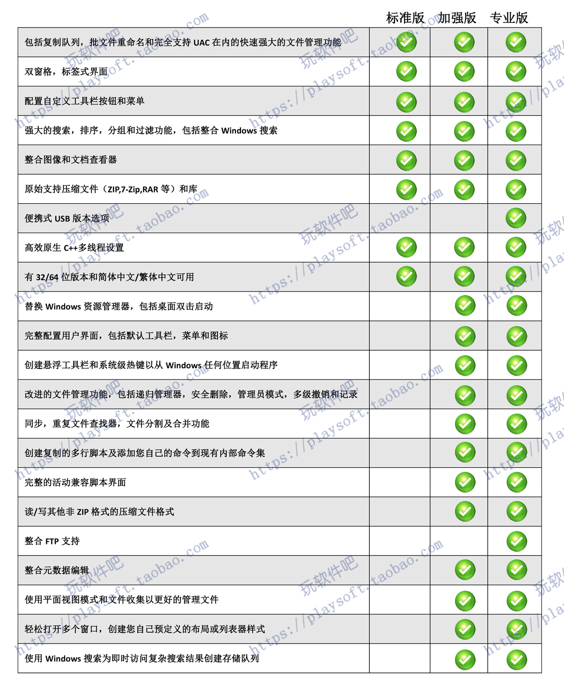

# Directory Opus
## 授权
DOpus 自 v13 起采用升级订阅模式，需要按年订阅更新，在订阅到期后可继续使用之前的版本（在之后也有可能会推出终身更新授权）。你可以直接[下载 DOpus ](https://www.gpsoft.com.au/DScripts/download.asp?id=release)开始试用，默认试用期为 30 天，[在注册后可以延长到 60 天](https://www.gpsoft.com.au/#download)。

购买渠道 | 新购 | 新购 + USB 导出 + 高级 FTP | 续期 | 备注
--- | --- | --- | --- | ---
[官网](https://www.gpsoft.com.au/#buynow) | 1+1[^machine-laptop]：89 AUD（~420元）<br />2+1：129 AUD（~606元）<br />5+1：249 AUD（~1169元）<br /><del>黑五：<ul><li>1+1：**53.4 AUD（~251元）**</li><li>2+1：77.4 AUD（~364元）</li><li>5+1：149.4 AUD（~703元）</li></ul></del> | USB 导出：10 AUD/导出授权 <br /> 高级 FTP：10 AUD（~47元） | 1+1：25 AUD（~117元）<br />2+1：40 AUD（~188元）<br />5+1：75 AUD（~352元）
[子清](https://item.taobao.com/item.htm?id=766978122797) | 1+1：**148元** | 1+1：**195元** | ？ | 无淘宝客服
[软购](https://apsgo.cn/tsARL0) | 1+1：158元<br />~~双十一：124.6元~~<br />~~黑五：158元~~ | 1+1：198元<br />~~双十一：180.6元~~<br />~~黑五：198元~~<br /> | ？ | 新用户-5元<br />不同等级会员每月有不同优惠，可找会员代购
[数码荔枝](https://store.lizhi.io/site/products/id/135?cid=1lsdbtbz) | 1+1：189元<br />`APPINN` 优惠码：179.55元<br />七月惠 +优惠码：152.61元<br />~~双十一：134.25元~~ | 1+1：239元<br />`APPINN` 优惠码：227.05元<br />七月惠 +优惠码：**192.99元**<br />~~双十一：194.25元~~ | ？ | 免费新会员-5元
[玩软件吧](https://item.taobao.com/item.htm?id=556078594244) | 1+1：169元 | 1+1：239元 | ？ | 客服响应不及时
[软购猜价](https://apsgo.com/guess/70) | | 1+1：历史最低 **160元** | | 积分可通过购买会员、软件和评论获得
[软购拍卖](https://apsgo.com/auctions) | | | | 不定期开启
~~[子清2](https://item.taobao.com/item.htm?id=669769551074)~~ | 1+1：210.49元 | 1+1：257.79元 | ？
[软代](https://directory-opus.com/)[^APSDAI] | 1+1：218元 | 1+1：268元 | ？

注意，中国经销商出售的都是中文版授权，只能使用中文语言，不能使用英文等其它语言。

这里不会列出 DOpus 的破解版，如果你确有需要，可以自行加入群组进行获取。

v12 升级 v13：

升级渠道 | 价格
--- | ---
[官网](https://www.gpsoft.com.au/#buynow) | 0~50 AUD（~234元）<br />折扣幅度取决于购买日期：在 v13 公测的前几个月（约 2023 年初）之后购买的授权可免费升级；折扣后的最高价格为两年续期价格，例如 1+1 授权的最高升级价格为 50 AUD。此外，中文版授权在升级后会变为全语言版，标准版（Light）在升级后会变为专业版。
[数码荔枝](https://store.lizhi.io/site/products/id/135?cid=1lsdbtbz) | 109元<br />`APPINN` 优惠码：103.55元<br />七月惠 +优惠码：**88.01元**<br />免费新会员-5元
[软购](https://apsgo.cn/tsARL0) | **89元**<br />新用户-5元
[子清](https://item.taobao.com/item.htm?id=766978122797) | 108元
[玩软件吧](https://item.taobao.com/item.htm?id=556078594244) | 105元
[软代](https://directory-opus.com/)[^APSDAI] | 118元
~~[子清2](https://item.taobao.com/item.htm?id=669769551074)~~ | 118.25元

升级可获得两年更新订阅的优惠已结束，目前升级只能获得一年更新。

<details><summary>v12</summary>

DOpus 采用大版本买断式授权，购买授权后可永久在一定数目的机器上使用相同大版本的 DOpus。若要使用新的大版本则需要购买升级授权，相较全新购买会有一定优惠，购买日期离新大版本推出足够短的用户也可以免费升级。

你可以直接[下载 DOpus ](https://www.gpsoft.com.au/DScripts/download.asp)开始试用，默认试用期为 30 天，如有需要可以[申请延长到 60 天](https://www.gpsoft.com.au/DScripts/evalrequest.asp)。

<details><summary>版本比较</summary>

注意，下表中的“加强版”实际上是专业版（Pro），“专业版”是 专业版 + USB 导出 + 高级 FTP。



官方比较：[Light vs Pro](https://www.gpsoft.com.au/program/pro-lite.html)
</details>

购买渠道 | 标准版（Light） | 专业版（Pro） | 专业版 + USB 导出 + 高级 FTP
--- | --- | --- | ---
[官网](https://www.gpsoft.com.au/order_intro.html) | 49 AUD（~230元）<br />黑五：24 AUD（~113元） | 1+1[^machine-laptop]：89 AUD（~419元）<br />2+1：129 AUD（~607元）<br />5+1：249 AUD（~1171元）<br />黑五：<ul><li>1+1：**53.4 AUD（~251元）**</li><li>2+1：77.4 AUD（~364元）</li><li>5+1：149.4 AUD（~703元）</li><li>优惠码 BF2022NOV</li></ul> | USB 导出：10 AUD/导出授权 <br /> 高级 FTP：10 AUD（~47元）
[玩软件吧](https://item.taobao.com/item.htm?id=556078594244) | 159元 | 1+1：**169元** | 1+1：239元
[数码荔枝](https://store.lizhi.io/site/products/id/135?cid=1lsdbtbz) | 169元<br />~~双十一：134.25元~~ | | 1+1：**239元**（免费新会员-5元）<br />~~双十一：194.25元~~
[软购](https://apsgo.cn/tsARL0) | 168元（新用户-5元）<br />~~双十一：124.6元~~<br />~~黑五：158元~~ | | 1+1：248元（新用户-5元）<br />~~双十一：180.6元~~<br />~~黑五：**198元**~~<br />不同等级会员每月有不同优惠
[子清](https://item.taobao.com/item.htm?id=669769551074) | | 1+1：~~185元~~ | 1+1：239元
[软代](https://directory-opus.com/)[^APSDAI] | 168元 | | 1+1：248元
[软购猜价](https://apsgo.com/guess/70) | | | 1+1：历史最低 **130元**<br />积分可通过购买会员、软件和评论获得
[软购拍卖](https://apsgo.com/auction/1300) | | | 1+1

注意，中国经销商出售的都是中文版授权，只能使用中文语言，不能使用英文等其它语言。

这里不会列出 DOpus 的破解版，如果你确有需要，可以自行加入群组进行获取。

</details>

[^machine-laptop]: 一台计算机 + 一台笔记本
[^APSDAI]: 也称 APSDAI、SOFTHEAD、奇睿天软

## 安装
下载安装包：
- 最新正式版：https://www.gpsoft.com.au/download/release
- [所有正式版](https://support.gpsoft.com.au/download)
- [所有版本](https://resource.dopus.com/c/new-releases/28?u=chaoses-ib)

### 静默安装
安装包参数：[Inno Setup Help](https://jrsoftware.org/ishelp/index.php?topic=setupcmdline)

安装证书：
```cmd
"C:\Program Files\GPSoftware\Directory Opus\dopus.exe" /cert "dopus_cert.txt" /regcode AAAAA-BBBBB-CCCCC-DDDD /norun
```

导入配置：
```
"C:\Program Files\GPSoftware\Directory Opus\dopus.exe" /config "c:\temp\opus config.ocb"
```

详见 [HOW TO: Perform silent (un)install of Directory Opus - Opus FAQs - Directory Opus Resource Centre](https://resource.dopus.com/t/how-to-perform-silent-un-install-of-directory-opus/1319?u=chaoses-ib)

<!-- TODO
## 性能
- 打开含有大量文件的文件夹
- 拖动大量文件

资源管理器都完全不卡
-->