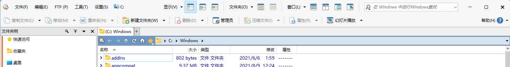
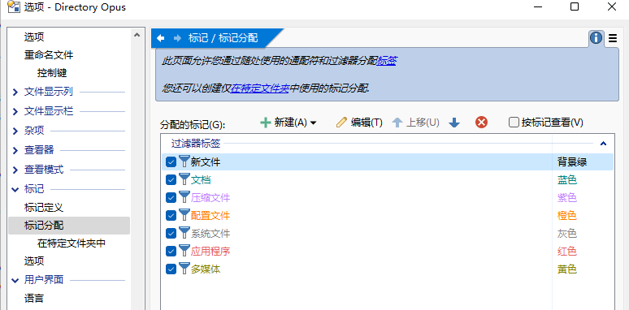
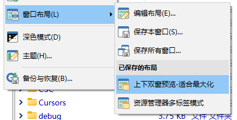

# 配置
## 配置模式
DOpus 有两种配置模式：
- 私人配置（默认）：每个用户都使用各自的配置
- 共享配置：所有用户共用一份配置

配置模式可在配置窗口菜单中更改。

## 配置路径
配置 | 路径别名 | 路径
--- | --- | ---
私人配置 | /dopusdata | `C:\Users\用户名\AppData\Roaming\GPSoftware\Directory Opus`
共享配置 | /dopusglobaldata | `C:\ProgramData\GPSoftware\Directory Opus`
缓存数据 | /dopuslocaldata | `C:\Users\用户名\AppData\Local\GPSoftware\Directory Opus`

## 恢复默认配置
虽然配置窗口菜单栏中有“重置所有设置到默认值”这一功能，但该功能只会重置设置，而不会重置命令、工具栏、快捷键和上下文菜单等其它配置。如果需要完全地恢复到默认配置，可下载该目录下的[默认配置文件](默认配置%20简体中文%20v12.23.ocb)，通过恢复配置功能进行完全重置。

## 配置分享
- 默认配置
  - [v13.7.1](https://github.com/Chaoses-Ib/DirectoryOpus/releases/download/2024-03-04/Config.Default.v13.7.1.ocb)

- [@小恐龙 2024-07-01](https://github.com/Chaoses-Ib/DirectoryOpus/releases/download/2024-03-04/Config.@xiaokonglong.2024-07-01.13-51.ocb) [^xiaokonglong]
  - 开启了[单窗口模式](../../浏览/多文件夹/单窗口模式.md)（在新标签页中打开外部文件夹）
  - 工具栏：

    
    - 开启了 将顶部工具栏移至窗口标题栏中
    - 菜单栏显示驱动器列表
    - 默认重命名（<kbd>Ctrl+3</kbd>）使用简单重命名而不是高级重命名
  - 开启了[列条形图](../../浏览/查看/列表/列.md#条形图)
  - 带有以下标记分配：

    

  - 带有以下命令：

    
  - 带有以下窗口布局：

    

[^xiaokonglong]: [换用到 Directory Opus，提问！（暂无新问题） - 讨论分享 - 小众软件官方论坛](https://meta.appinn.net/t/topic/58211/22?u=chaoses_ib)