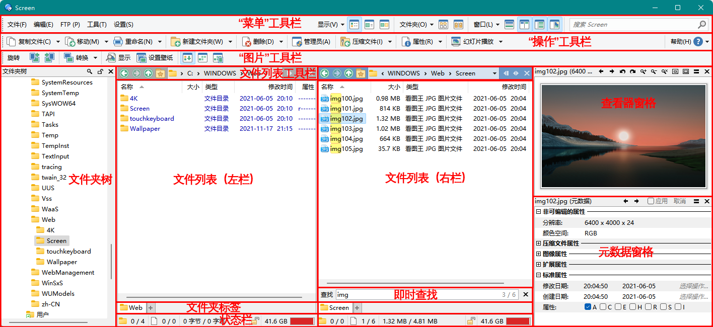
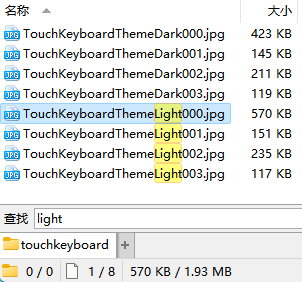
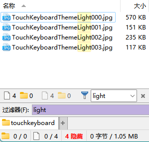
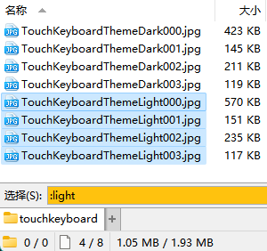
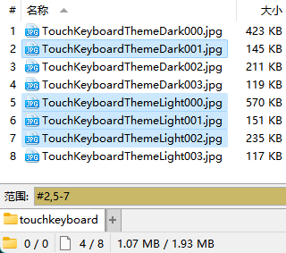
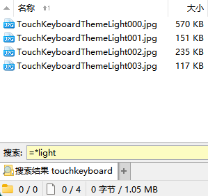
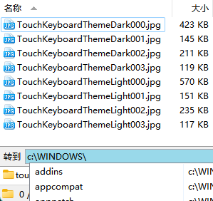
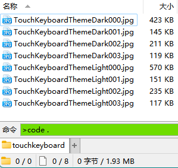
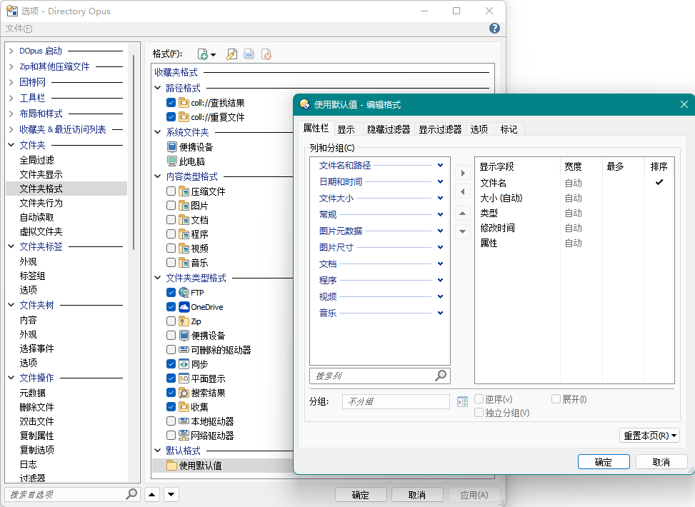
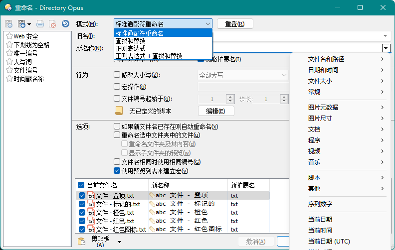

<h1 align="center">
  <a href="https://www.gpsoft.com.au/"></a>
  <br />
  Directory Opus
</h1>

<p align="center">由 <a href="https://www.gpsoft.com.au/">GPSoftware</a> 开发的一款上手简单、系统集成度高、功能强大的 Windows 文件管理器</p>

- [目录](SUMMARY.md)
- 镜像：[GitBook](https://chaoses-ib.gitbook.io/directory-opus/)（支持 AI 搜索）、~~[看云](https://www.kancloud.cn/chaoses/directory-opus/content)~~、~~[FastGit](https://hub.fastgit.xyz/Chaoses-Ib/DirectoryOpus)~~

> [!TIP]
> 可安装用户脚本 [Directory Opus 中文手册](https://greasyfork.org/zh-CN/scripts/491353-directory-opus-chinese-manual?locale_override=1) 来在打开 DOpus 的官方英文手册（<kbd>F1</kbd>）时自动跳转到中文手册的相应页面。

## 为什么要使用第三方文件管理器？
文件系统是目前使用最为广泛的数据组织形式，文件管理器是在 GUI（图形用户界面）下对这一系统的主要管理工具。如果你对使用文件系统进行数据组织有较强的依赖，文件管理器的好坏会在一定程度上影响你的工作效率。而 Windows 的官方文件管理器，即 Windows 文件资源管理器（Windows File Explorer）在功能性上并不出色，相比大部分第三方文件管理器都有所欠缺。因此，如果你需要提高自己的文件管理效率，使用第三方文件管理器是一种不错的方法。

在 Windows 上有着许多的第三方文件管理器，其中比较知名的有 Total Commander、Directory Opus 和 XYplorer。Total Commander 知名度最高，有着中文生态的优势；Directory Opus 相对来说具有上手简单、系统集成度高和功能强大的特点；XYplorer 也有不少人在使用。每个人的需求和偏好都有所不同，你可以在亲自尝试各个管理器之后再决定使用哪一个；当然，工具是用来解决问题的，你也可以每个工具都使用。

这个仍在编写中的文档仓库一方面是我对 DOpus 的个人经验总结，一方面是对 DOpus 中文生态的补充，希望能够对你有所帮助。

## 基本概念
### [文件窗口](浏览/窗口/README.md)


文件窗口由文件列表、[文件夹标签](浏览/多文件夹/标签页/README.md)、状态栏、[工具栏](浏览/窗口/工具栏/README.md)、文件夹树和其它窗格组成。除了必须保留一个文件列表外，文件窗口中的所有其它组件都可移除。

#### [主题](DO/配置/主题/README.md)


你可以通过主题来改变文件窗口的外观。

### [文件列表](浏览/查看/列表/README.md)
#### [视图](浏览/查看/列表/视图/README.md)
可用的视图有：[详细](浏览/查看/列表/视图/详细.md)、列表、[缩略图](浏览/查看/列表/视图/缩略图.md)、小图标、大图标、平铺和[增强模式](浏览/查看/列表/视图/详细.md#增强模式)，以及[平面视图](浏览/查看/列表/视图/平面视图.md)。

#### [列](浏览/查看/列表/列.md)
列通常是与文件相关的属性，例如文件名、大小和修改日期。除了这些基本属性之外，DOpus 也内置了备注、标签、星级这些常用的元属性，以及子文件数和 MD5 这样的计算型属性。DOpus 也为一些常见的文件类型内置了属性列，例如图片分辨率、视频时长、视频分辨率、视频帧率、音乐艺术家、音乐专辑、程序版本等等。除了这些内置列外，也可使用脚本和 Shell 的列处理器来实现自定义列。

#### [标记](浏览/查看/列表/标记.md)


标记可以让文件以自定义的颜色显示，同时也支持设置文件图标和状态图标，设置加粗、斜体和下划线字体样式，以及将文件置顶。标记可以手动设置，也可以用标记过滤器自动分配。

除了标记外，DOpus 还可对文件设置描述、标签和评分这三项[扩展属性](类型/元数据/README.md#扩展属性)。

#### [即时查找](浏览/查看/列表/即时查找.md)
即时查找功能可以实现即时查找或过滤文件；通过通配符或范围选择文件；跳转到其它路径或文件夹标签；以及执行 CLI 命令（<kbd>></kbd> 内置命令、<kbd>?</kbd> cmd 及 <kbd>|</kbd> WSL）。如图所示：

查找 | 过滤 | 选择 | 范围
--- | --- | --- | ---
 |  |  | 
搜索 | 跳转 | 标签页 | 命令
 |  |  | 

#### [文件夹格式](浏览/查看/文件夹格式.md)


文件夹格式决定了每个文件夹的显示格式，包括视图、列、排序方式、分组方式、文件过滤器、标记过滤器、背景颜色和文件夹标签颜色等选项。文件夹格式可通过文件夹路径、内容类型或文件夹类型来决定生效范围。

### [文件操作](操作/README.md)
#### [来源和目标](浏览/多文件夹/来源和目标.md)
许多文件操作都是发生在两个或多个目录之间的。对于这些操作，通常的方法是不断复制粘贴，或者来回拖曳，比较繁琐。为了提高操作效率，可以指定其中一个目录为目标目录，当进行复制、移动等操作时直接复制或移动到目标目录，省去每次都要指定目标的麻烦。

使用双栏模式时，当前文件列表为来源目录，对侧文件列表为目标目录；  
使用单栏模式时，当前文件窗口为来源目录，最近激活的另一个文件窗口为目标目录，状态栏中会显示所属窗口的状态。  

一些相关的内置操作如下：

操作 | 快捷键 | 工具栏
--- | --- | ---
复制文件到目标目录 | <kbd><kbd>Ctrl</kbd>+<kbd>1</kbd></kbd> | 操作/复制文件
询问新文件名后复制文件到目标目录 | <kbd><kbd>Ctrl</kbd>+<kbd>Shift</kbd>+<kbd>1</kbd></kbd> | 操作/复制文件/复制为
移动文件到目标目录 | <kbd><kbd>Ctrl</kbd>+<kbd>2</kbd></kbd> | 操作/移动
询问新文件名后移动文件到目标目录 | <kbd><kbd>Ctrl</kbd>+<kbd>Shift</kbd>+<kbd>2</kbd></kbd> | 操作/移动/移动为
在目标目录创建文件的快捷方式 | | 操作/复制文件/创建快捷方式

#### [高级重命名](操作/重命名.md)


高级重命名可以实现复杂的批量重命名。支持通配符、宏（编辑录制）和正则表达式，能够插入序号和元数据字段，也可以使用 JS/VBS 脚本进行自定义处理。配置好的重命名规则可以保存为预设（上图左侧），便于之后再次使用。

相关的内置操作如下：

操作 | 快捷键 | 工具栏
--- | --- | ---
高级重命名 | <kbd><kbd>Ctrl</kbd>+<kbd>3</kbd></kbd> | 操作/重命名

#### [文件类型](类型/README.md)


你可以为每个文件类型定义自己的鼠标动作、右键菜单和[信息提示](浏览/查看/信息提示.md)。除了独立的文件类型外，DOpus 还有上图中的特殊文件类型和[文件类型群组](类型/README.md#文件类型群组)，便于同时为一组文件类型定义动作。

### [命令](DO/命令/README.md)
“命令”是 DOpus 内置的一种简易脚本语言，一个例子如下：
```cmd
@keydown:none   // 如果没有修饰键被按下
Copy            // 复制选中文件到目标目录
@keydown:shift  // 如果 Shift 被按下
Copy AS         // 以指定名称（弹窗输入）复制选中文件到目标目录
```
DOpus 中的大部分用户操作都是通过命令实现的，包括大部分工具栏按钮、菜单按钮、热键和文件类型事件。换句话说，在这些地方你都可以通过命令来实现自定义功能。

除了命令外，你也可以通过脚本（主要为 JScript 和 VBScript）来实现更为复杂的功能，或者也可以通过脚本来定义自己的命令，扩展命令的功能。

## 其它
### [授权](DO/README.md#授权)
DOpus 自 v13 起采用升级订阅模式，需要按年订阅更新，在订阅到期后可继续使用之前的版本（在之后也有可能会推出终身更新授权）。你可以直接[下载 DOpus ](https://www.gpsoft.com.au/DScripts/download.asp?id=release)开始试用，默认试用期为 30 天，[在注册后可以延长到 60 天](https://www.gpsoft.com.au/#download)。

购买渠道 | 新购 | 新购 + USB 导出 + 高级 FTP | 续期 | 备注
--- | --- | --- | --- | ---
[官网](https://www.gpsoft.com.au/#buynow) | 1+1[^machine-laptop]：89 AUD（~420元）<br />2+1：129 AUD（~606元）<br />5+1：249 AUD（~1169元）<br /><del>黑五：<ul><li>1+1：**53.4 AUD（~251元）**</li><li>2+1：77.4 AUD（~364元）</li><li>5+1：149.4 AUD（~703元）</li></ul></del> | USB 导出：10 AUD/导出授权 <br /> 高级 FTP：10 AUD（~47元） | 1+1：25 AUD（~117元）<br />2+1：40 AUD（~188元）<br />5+1：75 AUD（~352元）
[子清](https://item.taobao.com/item.htm?id=766978122797) | 1+1：**148元** | 1+1：**195元** | ？ | 无淘宝客服
[软购](https://apsgo.cn/tsARL0) | 1+1：158元<br />~~双十一：124.6元~~<br />~~黑五：158元~~ | 1+1：198元<br />~~双十一：180.6元~~<br />~~黑五：198元~~<br /> | ？ | 新用户-5元<br />不同等级会员每月有不同优惠，可找会员代购
[数码荔枝](https://store.lizhi.io/site/products/id/135?cid=1lsdbtbz) | 1+1：189元<br />`APPINN` 优惠码：179.55元<br />七月惠 +优惠码：152.61元<br />~~双十一：134.25元~~ | 1+1：239元<br />`APPINN` 优惠码：227.05元<br />七月惠 +优惠码：**192.99元**<br />~~双十一：194.25元~~ | ？ | 免费新会员-5元
[玩软件吧](https://item.taobao.com/item.htm?id=556078594244) | 1+1：169元 | 1+1：239元 | ？ | 客服响应不及时
[软购猜价](https://apsgo.com/guess/70) | | 1+1：历史最低 **160元** | | 积分可通过购买会员、软件和评论获得
[软购拍卖](https://apsgo.com/auctions) | | | | 不定期开启
~~[子清2](https://item.taobao.com/item.htm?id=669769551074)~~ | 1+1：210.49元 | 1+1：257.79元 | ？
[软代](https://directory-opus.com/)[^APSDAI] | 1+1：218元 | 1+1：268元 | ？

注意，中国经销商出售的都是中文版授权，只能使用中文语言，不能使用英文等其它语言。

这里不会列出 DOpus 的破解版，如果你确有需要，可以自行加入群组进行获取。

v12 升级 v13：

升级渠道 | 价格
--- | ---
[官网](https://www.gpsoft.com.au/#buynow) | 0~50 AUD（~234元）<br />折扣幅度取决于购买日期：在 v13 公测的前几个月（约 2023 年初）之后购买的授权可免费升级；折扣后的最高价格为两年续期价格，例如 1+1 授权的最高升级价格为 50 AUD。此外，中文版授权在升级后会变为全语言版，标准版（Light）在升级后会变为专业版。
[数码荔枝](https://store.lizhi.io/site/products/id/135?cid=1lsdbtbz) | 109元<br />`APPINN` 优惠码：103.55元<br />七月惠 +优惠码：**88.01元**<br />免费新会员-5元
[软购](https://apsgo.cn/tsARL0) | 108元<br />新用户-5元
[子清](https://item.taobao.com/item.htm?id=766978122797) | 108元
[玩软件吧](https://item.taobao.com/item.htm?id=556078594244) | ？
[软代](https://directory-opus.com/)[^APSDAI] | 118元
[子清2](https://item.taobao.com/item.htm?id=669769551074) | 118.25元

目前升级可获得两年更新订阅，在一定时间后，升级将只获得一年更新。

[^machine-laptop]: 一台计算机 + 一台笔记本
[^APSDAI]: 也称 APSDAI、SOFTHEAD、奇睿天软

### 群组
- [Telegram 群组](https://t.me/IbDirectoryOpusGroup)、[频道](https://t.me/IbDirectoryOpus)
- [QQ 群](https://jq.qq.com/?_wv=1027&k=8iTFF5J8)（313295509）

### 英文资源
- [帮助手册](https://docs.dopus.com/)

  <details><summary>v12</summary>

  也可在 DOpus 中按 <kbd>F1</kbd> 打开本地帮助（默认为本地网页，如有需要可在 `配置/杂项/高级/行为/help_interface` 处更改为 CHM）。
  </details>
- [官方论坛](https://resource.dopus.com/)