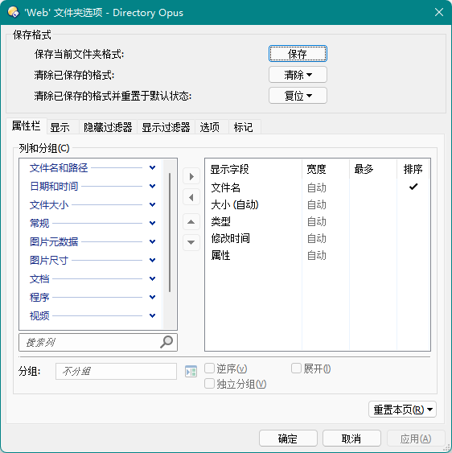

# Directory Opus
[Directory Opus](https://www.gpsoft.com.au/) 是 GPSoftware 所开发的一款 Windows 文件管理器，主要特点是上手简单、系统集成度高和功能强大。

## 基本概念
### 文件窗口
  
文件窗口由文件列表、文件夹标签、状态栏、工具栏、文件夹树和其它窗格组成。除了文件列表外，文件窗口中的所有其它组件都可移除。

### 文件夹格式

通过文件夹格式可以为不同的文件夹配置不同的显示选项，包括：
* 视图  
  可用的视图有：详细、列表、缩略图、小图标、大图标、平铺和增强模式。
* 列  
  列通常是与文件相关的属性，例如文件名、大小和修改日期。除了这些基本属性之外，DOpus 也内置了备注、标签、星级这些常用的元属性，以及子文件数和 MD5 这样的计算型属性。DOpus 也为一些常见的文件类型内置了属性列，例如图片分辨率、视频时长、视频分辨率、视频帧率、音乐艺术家、音乐专辑、程序版本等等。除了这些内置列外，也可使用脚本和 Shell 的列处理器来实现自定义列。
* 排序方式  
  支持排序时混合文件与文件夹和手动排序。
* 分组方式
* 文件过滤器  
  按照指定的规则隐藏或显示文件。
* 标记过滤器  
  按照指定的规则为文件分配标记。标记可以让文件以自定义的颜色显示，同时也支持设置文件图标和状态图标，设置加粗、斜体和下划线字体样式，以及将文件置顶。当然，除了标记过滤器外，标记也可以手动设置。
* 背景颜色
* 文件夹标签颜色

### 来源和目标
许多文件操作都是发生在两个或多个目录之间的。对于这些操作，通常的方法是不断复制粘贴，或者来回拖曳，比较繁琐。为了提高操作效率，可以在 DOpus 中指定其中一个目录为目标目录，当进行复制、移动等操作时直接复制或移动到目标目录，省去每次都要指定目标的麻烦。

使用双栏模式时，当前文件列表为来源，对侧文件列表为目标；  
使用单栏模式时，当前文件窗口为来源，最近激活的另一个文件窗口为目标，状态栏中会显示所属窗口的状态。  
来源和目标状态也可以从文件列表工具栏的背景色看出来：深蓝色为来源，灰色为目标。