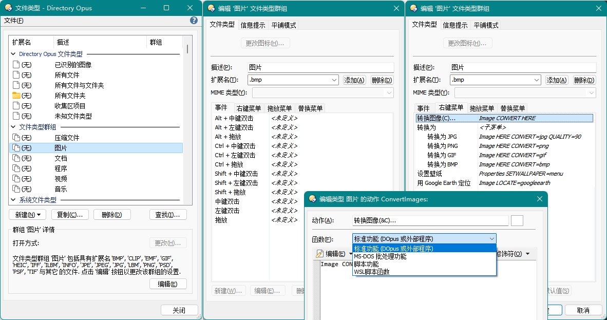

# Directory Opus
[Directory Opus](https://www.gpsoft.com.au/) 是 GPSoftware 所开发的一款 Windows 文件管理器，主要特点是上手简单、系统集成度高和功能强大。

- [目录](SUMMARY.md)
- 镜像：[看云](https://www.kancloud.cn/chaoses/directory-opus/content)（更新不同步）

## 为什么要使用第三方文件管理器？
文件系统是目前使用最为广泛的数据组织形式，文件管理器是在 GUI（图形用户界面）下对这一系统的主要管理工具。如果你对使用文件系统进行数据组织有较强的依赖，文件管理器的好坏会在一定程度上影响你的工作效率。而 Windows 的官方文件管理器，即 Windows 文件资源管理器（Windows File Explorer）在功能性上并不出色，相比大部分第三方文件管理器都有所欠缺。因此，如果你需要提高自己的文件管理效率，使用第三方文件管理器是一种不错的方法。

在 Windows 上有着许多的第三方文件管理器，其中比较知名的有 Total Commander、Directory Opus 和 XYplorer。Total Commander 知名度最高，有着中文生态的优势；Directory Opus 相对来说具有上手简单、系统集成度高和功能强大的特点；XYplorer 也有不少人在使用。每个人的需求和偏好都有所不同，你可以在亲自尝试各个管理器之后再决定使用哪一个；当然，工具是用来解决问题的，你也可以每个工具都使用。

这个仍在编写中的文档仓库一方面是我对 DOpus 的个人经验总结，一方面是对 DOpus 中文生态的补充，希望能够对你有所帮助。

## 基本概念
### 文件窗口
  
[文件窗口](文件窗口/README.md)由文件列表、[文件夹标签](文件窗口/文件夹标签.md)、状态栏、工具栏、文件夹树和其它窗格组成。除了必须保留一个文件列表外，文件窗口中的所有其它组件都可移除。

#### 主题
  
你可以通过[主题](文件窗口/主题/README.md)来改变文件窗口的外观。

### 文件列表
#### 视图
可用的[视图](文件列表/视图.md)有：详细、列表、[缩略图](文件列表/缩略图.md)、小图标、大图标、平铺和增强模式，以及[平面视图](文件列表/平面视图.md)。

#### 列
[列](文件列表/列.md)通常是与文件相关的属性，例如文件名、大小和修改日期。除了这些基本属性之外，DOpus 也内置了备注、标签、星级这些常用的元属性，以及子文件数和 MD5 这样的计算型属性。DOpus 也为一些常见的文件类型内置了属性列，例如图片分辨率、视频时长、视频分辨率、视频帧率、音乐艺术家、音乐专辑、程序版本等等。除了这些内置列外，也可使用脚本和 Shell 的列处理器来实现自定义列。

#### 标记
  
标记可以让文件以自定义的颜色显示，同时也支持设置文件图标和状态图标，设置加粗、斜体和下划线字体样式，以及将文件置顶。标记可以手动设置，也可以用标记过滤器自动分配。

除了标记外，DOpus 还可对文件设置描述、标签和评分这三项[扩展属性](文件操作/元数据.md#扩展属性)。

#### 即时查找
即时查找功能可以实现即时查找或过滤文件；通过通配符或范围选择文件；跳转到其它路径或文件夹标签；以及执行 CLI 命令（`>` 内置命令、`?` cmd 及 `|` WSL）。如图所示：

查找 | 过滤 | 选择 | 范围
--- | --- | --- | ---
 |  |  | 
搜索 | 跳转 | 标签页 | 命令
 |  |  | 

#### 文件夹格式


[文件夹格式](文件列表/文件夹格式.md)决定了每个文件夹的显示格式，包括视图、列、排序方式、分组方式、文件过滤器、标记过滤器、背景颜色和文件夹标签颜色等选项。文件夹格式可通过文件夹路径、内容类型或文件夹类型来决定生效范围。

### 文件操作
#### 来源和目标
许多文件操作都是发生在两个或多个目录之间的。对于这些操作，通常的方法是不断复制粘贴，或者来回拖曳，比较繁琐。为了提高操作效率，可以指定其中一个目录为目标目录，当进行复制、移动等操作时直接复制或移动到目标目录，省去每次都要指定目标的麻烦。

使用双栏模式时，当前文件列表为来源目录，对侧文件列表为目标目录；  
使用单栏模式时，当前文件窗口为来源目录，最近激活的另一个文件窗口为目标目录，状态栏中会显示所属窗口的状态。  

一些相关的内置操作如下：
操作 | 快捷键 | 工具栏
--- | --- | ---
复制文件到目标目录 | Ctrl+1 | 操作/复制文件
询问新文件名后复制文件到目标目录 | Ctrl+Shift+1 | 操作/复制文件/复制为
移动文件到目标目录 | Ctrl+2 | 操作/移动
询问新文件名后移动文件到目标目录 | Ctrl+Shift+2 | 操作/移动/移动为
在目标目录创建文件的快捷方式 | | 操作/复制文件/创建快捷方式

#### 高级重命名
  
[高级重命名](文件操作/重命名.md)可以实现复杂的批量重命名。支持通配符、宏（编辑录制）和正则表达式，能够插入序号和元数据字段，也可以使用 JS/VBS 脚本进行自定义处理。配置好的重命名规则可以保存为预设（上图左侧），便于之后再次使用。

相关的内置操作如下：
操作 | 快捷键 | 工具栏
--- | --- | ---
高级重命名 | Ctrl+3 | 操作/重命名

#### 文件类型
  
你可以为每个[文件类型](文件操作/文件类型.md)定义自己的鼠标动作、右键菜单和[信息提示](文件列表/信息提示.md)。除了独立的文件类型外，DOpus 还有上图中的特殊文件类型和[文件类型群组](文件操作/文件类型.md#文件类型群组)，便于同时为一组文件类型定义动作。

### 命令
[“命令”](命令/README.md)是 DOpus 内置的一种简易脚本语言，一个例子如下：
```c
// 如果没有按下修饰键：
@keydown:none
// 复制选中文件到目标目录
Copy

// 如果按下了 Shift：
@keydown:shift
// 以指定名称（弹窗输入）复制选中文件到目标目录
Copy AS
```
DOpus 中的大部分用户操作都是通过命令实现的，包括大部分工具栏按钮、菜单按钮、热键和文件类型事件。换句话说，在这些地方你都可以通过命令来实现自定义功能。

除了命令外，你也可以通过脚本（主要为 JScript 和 VBScript）来实现更为复杂的功能，或者也可以通过脚本来定义自己的命令，扩展命令的功能。

## 其它
### 讨论
- [讨论区](https://github.com/Chaoses-Ib/DirectoryOpus/discussions)  
  请尽量在讨论区中提问，便于帮助遇到了同样问题的人。
- [Telegram 群组](https://t.me/IbDirectoryOpusGroup)
- [QQ 群](https://jq.qq.com/?_wv=1027&k=8iTFF5J8)（313295509）