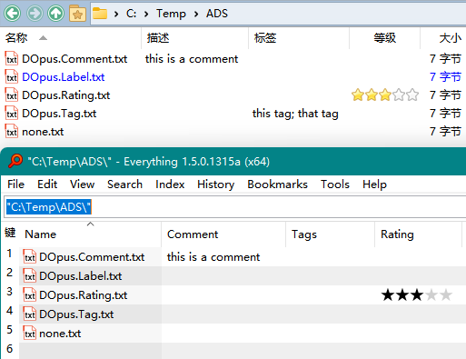

# 搜索
## 元数据
DOpus 的四项扩展属性，标记、描述、标签、评分，都可以通过查找窗格的高级模式进行搜索：

此外，Everything [v1.5.0.1276 以上](https://www.voidtools.com/forum/viewtopic.php?f=12&t=9787)也支持了搜索 DOpus 的描述、标签和评分 [^everything]，不过目前没有中文语言，只能使用 v1.4 的语言包汉化一部分界面。若要开启支持，需要在安装后按照以下步骤设置：

1. 在 Everything 搜索框中输入 `/opus_meta_information=1` 并回车，此时状态栏会显示 `opus_meta_information=1`
2. 输入 `/restart` 并回车来重启 Everything
3. 右键列表表头，在 `Add Columns...` 中添加 `Comment`、`Tags` 和 `Rating` 三列（注意不是 Windows Property System 中的 `标签` 和 `描述`），如图：

     
   （图中由于 DOpus 版本较旧，Everything 未能正确读取标签）

可以通过使用 `comment:` 、`tags:` 和 `rating:` 来搜索指定元数据（可以通过右键相应表头，选择 `Search for ...` 来自动输入相应前缀），例如：

另外，Everything 默认不会索引扩展属性，而是会在搜索时按需读取，如果想要建立索引可以手动在 `Options → Indexes → Properties` 中添加要索引的属性。

[^everything]: [Ability to Search Tags - voidtools forum](https://www.voidtools.com/forum/viewtopic.php?f=4&t=9877)

## 通过 Everything 搜索
- [Everything 搜索](https://github.com/Chaoses-Ib/IbDOpusScripts/blob/main/Buttons/EverythingSearch.zh-Hans.cmd.dcf)

  通过 [Everything](https://www.voidtools.com/) 在当前文件夹下搜索文件。

  

  默认热键 <kbd><kbd>Ctrl</kbd>+<kbd>E</kbd></kbd>。
