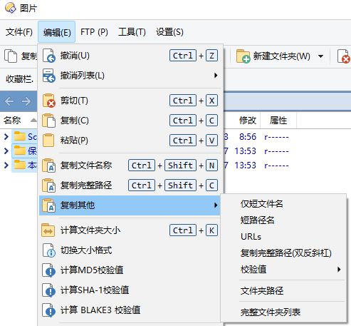

# 剪贴板
详见 [Clipboard](/Manual/reference/command_reference/internal_commands/clipboard.zh.md) 命令。

## 复制文件名、路径
DOpus 自带有复制文件名和路径的功能，可以通过上下文菜单、工具栏或热键触发：




其中工具栏除了支持常规的文件名和路径格式外，还支持以下格式：
- 8.3 短文件名/路径：例如 `C:\PROGRA~1\WINDOW~3`
- URL 路径：例如 `file:///C:/Windows`、`file:///C:/Program%20Files%20(x86)`
- 双反斜杠路径：例如 `C:\\Windows`

### 正斜杠路径
如果想复制为正斜杠路径格式，例如 `C:/Windows`，可以使用以下命令：
```cmd
Clipboard COPYNAMES=unc REGEXP (.*)\\(.*)# \1/\2
```
按钮（可粘贴到工具栏）：
```xml
<?xml version="1.0"?>
<button backcol="none" display="both" hotkey_label="yes" label_pos="right" textcol="none">
	<label>复制完整路径（正斜杠）</label>
	<tip>复制所有选定文件的完整路径到剪贴板</tip>
	<icon1>#copyfilenames</icon1>
	<function type="normal">
		<instruction>Clipboard COPYNAMES=unc REGEXP (.*)\\(.*)# \1/\2</instruction>
	</function>
</button>
```

### 环境变量、文件夹别名相对路径
相较于绝对路径，环境变量、文件夹别名相对路径的兼容性更好，可以在不同环境下使用。可以通过安装 [ClipEdit 脚本](https://github.com/Chaoses-Ib/IbDOpusScripts/blob/main/Commands/ClipEdit.js)，使用 `ClipEdit` 命令来支持这些格式：

- 环境变量相对路径：例如 `%systemroot%\notepad.exe`（完整路径为 `C:\Windows\notepad.exe`）

  命令：
  ```cmd
  Clipboard COPYNAMES=unc
  ClipEdit ENVVAR
  ```
  按钮（可粘贴到工具栏）：
  ```xml
  <?xml version="1.0"?>
  <button backcol="none" display="both" hotkey_label="yes" label_pos="right" textcol="none">
    <label>复制完整路径（环境变量）</label>
    <tip>复制所有选定文件的完整路径到剪贴板</tip>
    <icon1>#copyfilenames</icon1>
    <function type="normal">
      <instruction>Clipboard COPYNAMES=unc</instruction>
      <instruction>ClipEdit ENVVAR</instruction>
    </function>
  </button>
  ```

- 文件夹别名相对路径：例如 `/windows\notepad.exe`（完整路径为 `C:\Windows\notepad.exe`）
  
  对于 DOpus 内部路径，使用文件夹别名可以大幅缩短路径长度，例如可以将 `C:\Users\Alice\AppData\Roaming\GPSoftware\Directory Opus\Script AddIns\ClipEdit.js` 缩短为 `/scripts\ClipEdit.js` 。

  命令：
  ```cmd
  Clipboard COPYNAMES=unc
  ClipEdit ALIAS
  ```
  按钮（可粘贴到工具栏）：
  ```xml
  <?xml version="1.0"?>
  <button backcol="none" display="both" hotkey_label="yes" label_pos="right" textcol="none">
    <label>复制完整路径（别名）</label>
    <tip>复制所有选定文件的完整路径到剪贴板</tip>
    <icon1>#copyfilenames</icon1>
    <function type="normal">
      <instruction>Clipboard COPYNAMES=unc</instruction>
      <instruction>ClipEdit ALIAS</instruction>
    </function>
  </button>
  ```

- 环境变量/文件夹别名相对路径：先尝试使用环境变量，再尝试文件夹别名

  命令：
  ```cmd
  Clipboard COPYNAMES=unc
  ClipEdit ENVVAR
  ClipEdit ALIAS
  ```
  按钮（可粘贴到工具栏）：
  ```xml
  <?xml version="1.0"?>
  <button backcol="none" display="both" hotkey_label="yes" label_pos="right" textcol="none">
    <label>复制完整路径（环境变量/别名）</label>
    <tip>复制所有选定文件的完整路径到剪贴板</tip>
    <icon1>#copyfilenames</icon1>
    <function type="normal">
      <instruction>Clipboard COPYNAMES=unc</instruction>
      <instruction>ClipEdit ENVVAR</instruction>
      <instruction>ClipEdit ALIAS</instruction>
    </function>
  </button>
  ```

## 粘贴为文件
当向 DOpus 的文件列表中粘贴文本或图片时，DOpus 会自动以文件的形式将粘贴内容保存。

当粘贴文本时，DOpus 对于只含 ASCII 字符的文本默认会使用 ANSI 编码（等效于 ASCII 编码），对于其它文本则会使用 UTF-16 LE 编码。简单地说，英文文本会被使用一种通用编码进行保存，中文文本则会被使用一种不常见的编码进行保存。在高级选项中可以指定默认文本编码：


推荐使用更通用的 `utf8` 作为默认编码。

当粘贴图片时，DOpus 默认会使用 JPEG 格式。默认图片格式也可以在高级选项中进行更改：


尽管压缩率较高，但 JPEG 是一种有损压缩格式，如果希望在粘贴时保留原始图片，推荐使用 PNG 格式作为默认格式。

除了高级设置外，也可以通过 `Clipboard` 命令进行自定义粘贴，比如在每次粘贴时都询问文本编码和图片格式：
```cmd
// 默认文件名可省略（AS=ask）
Clipboard PASTE AS=ask:默认文件名
```


