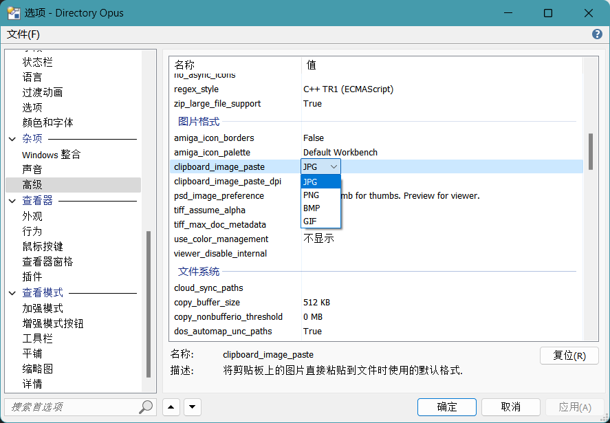

# 剪贴板
## 粘贴为文件
当向 DOpus 的文件列表中粘贴文本或图片时，DOpus 会自动以文件的形式将粘贴内容保存。

当粘贴文本时，DOpus 对于只含 ASCII 字符的文本默认会使用 ANSI 编码（等效于 ASCII 编码），对于其它文本则会使用 UTF-16 LE 编码。简单地说，英文文本会被使用一种通用编码进行保存，中文文本则会被使用一种不常见的编码进行保存。在高级选项中可以指定默认文本编码：


推荐使用更通用的 `utf8` 作为默认编码。

当粘贴图片时，DOpus 默认会使用 JPEG 格式。默认图片格式也可以在高级选项中进行更改：



尽管压缩率较高，但 JPEG 是一种有损压缩格式，如果希望在粘贴时保留原始图片，推荐使用 PNG 格式作为默认格式。

除了高级设置外，也可以通过 `Clipboard` 命令进行自定义粘贴，比如在每次粘贴时都询问文本编码和图片格式：
```cmd
// 默认文件名可省略（AS=ask）
Clipboard PASTE AS=ask:默认文件名
```


