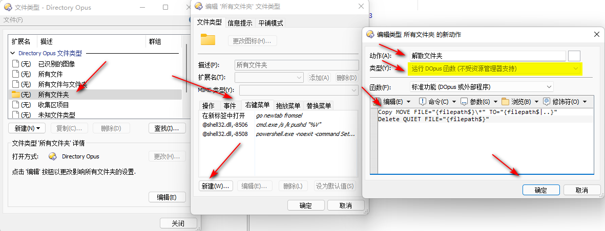
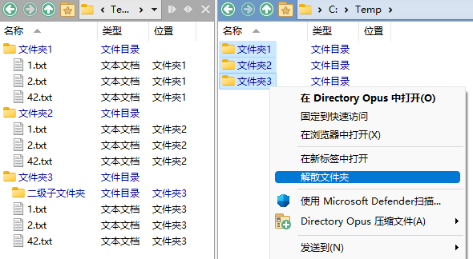
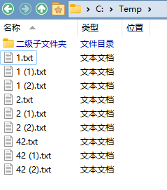

# 文件移动
## 命令
移动选中文件到指定文件夹：
```cmd
Copy MOVE TO "C:\目标文件夹"
```

详见 [Copy](/Manual/reference/command_reference/internal_commands/copy.zh.md) 命令。

## 移动到新建文件夹中
<!-- TODO: Tg -->

输入新建文件夹名，移动选中文件到新建文件夹中：
```cmd
Copy MOVE CREATEFOLDER HERE
```
新建文件夹名不能与选中文件同名。

移动选中文件到同名文件夹中：
```cmd
Copy MOVE CREATEFOLDER="{file$|noext}" HERE
```
以上命令在多选时，每个文件都会被移入到各自的同名文件夹中。如果想让所有文件都移入第一个文件的同名文件夹中，可以使用以下命令：
```cmd
@set first={file$|noext}
Copy MOVE CREATEFOLDER="{$first}" HERE
```

## 解散文件夹
“解散文件夹”指的是将指定文件夹中的文件全部移动到上一层级，并删除原文件夹。

在 DOpus 中，可以通过以下命令来实现解散文件夹[^FlintyLemming]：
```cmd
Copy MOVE FILE="{filepath$}\*" TO="{filepath$|..}"
Delete QUIET FORCE FILE="{filepath$}"
```

通过 `设置 > 文件类型` 打开文件类型编辑器，按下图操作，可以在文件夹的上下文菜单中添加一个“解散文件夹”按钮：



操作前 | 操作后
--- | ---
 | 

如果想要将选中文件夹中的所有子文件夹也一同解散，则可以使用以下命令[^move-all-subfolders-files-11]：
```cmd
@dirsonly
Rename PATTERN="*" TO="{filepath|..}*" AUTORENAME RECURSE
Delete QUIET FORCE
```

或者使用平面视图来手动实现：
1. 右键单击平面视图按钮，选中 `混合`（或左键单击两次平面视图按钮），让所有子文件混合显示

   

2. 手动将文件移动到上一层级
3. 删除剩余的文件夹

<details><summary>上述平面视图操作也可以使用命令来实现</summary>

[^move-all-subfolders-files-9]
```cmd
SET flatview=MixedNoFolders
SELECT ALLFILES
COPY MOVE HERE FLATVIEWCOPY=single
SET flatview=off
SELECT ALLDIRS
```
</details>


[^FlintyLemming]: [@FlintyLemming](https://t.me/IbDirectoryOpusGroup/495)
[^move-all-subfolders-files-9]: [Move all subfolder files to current folder - Help & Support - Directory Opus Resource Centre](https://resource.dopus.com/t/move-all-subfolder-files-to-current-folder/9195/9)
[^move-all-subfolders-files-11]: [Move all subfolder files to current folder - Help & Support - Directory Opus Resource Centre](https://resource.dopus.com/t/move-all-subfolder-files-to-current-folder/9195/11)