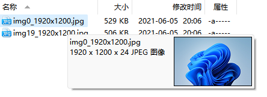
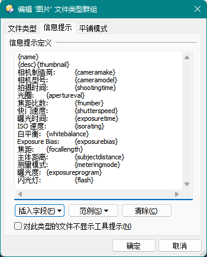

# 信息提示
信息提示可以展示一个文件的信息，如图：  


## 触发途径
- 鼠标在文件名上悬浮一定时间
- 选中文件后按 Ctrl 键一定时间  
  具体时长可在 `文件显示栏/选项/按键延迟` 处设置，最小为 1ms。

## 提示内容
信息提示的内容与具体的文件类型有关，各个文件类型的信息提示格式可在文件类型编辑器中修改：  


例子：  
显示指定尺寸（256）的缩略图：
```
{thumbnail:1:256}
```
注意，最终显示尺寸还受[缩略图最大尺寸](缩略图.md#如何调整缩略图的最大尺寸)的限制。