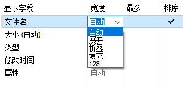

# 列
## 列宽

列宽有五种选项：
选项 | 说明
--- | ---
自动 | 根据内容和列标题自动计算宽度
折叠 | 自动计算宽度，且在列表宽度不足时自动缩短
填充 | 占用列表剩下的所有宽度
展开 | 自动计算宽度，且置于折叠列或填充列右侧时不会影响它们的效果\*
固定 | 单位为像素

可通过 `最多` 来限制最大列宽（对填充和固定模式无效）。

\*：当展开列置于折叠列右侧时，如果列表宽度不足它会首先被截短，在它完全消失后折叠列才会开始缩短；当展开列置于填充列右侧时，只有向右滚动才能看到它。

## 自定义列
你可以通过 [Custom Text and Regexp](https://resource.dopus.com/t/column-custom-text-and-regexp/18727) 从文件名中提取文本为列：  

