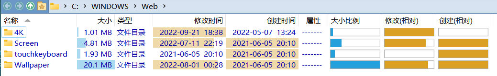

# 列
## 列宽

列宽有五种选项：
选项 | 说明
--- | ---
自动 | 根据内容和列标题自动计算宽度
折叠 | 自动计算宽度，且在列表宽度不足时自动缩短
填充 | 占用列表剩下的所有宽度
展开 | 自动计算宽度，且置于折叠列或填充列右侧时不会影响它们的效果\*
固定 | 单位为像素

可通过 `最多` 来限制最大列宽（对填充和固定模式无效）。

\*：当展开列置于折叠列右侧时，如果列表宽度不足它会首先被截短，在它完全消失后折叠列才会开始缩短；当展开列置于填充列右侧时，只有向右滚动才能看到它。

## 条形图
DOpus 可以在大小列、修改时间列和创建时间列的下方显示条形图：

条形图默认不开启，若要使用，需要在配置窗口中勾选相应设置：

注意，修改时间列的设置项实际上对修改时间列和创建时间列都会生效。

修改时间和创建时间的条形图默认是负时间轴的，即最旧的文件的最高，最新的文件最低。如果要改为正时间轴，可以在 `显示/字段` 中勾选 `修改(相对）` 和 `创建（相对）` 的 `图片反转`（图表反转）：

另外，条形图也可以作为单独的列使用：

## Everything 大小列
你可以通过 [IbDOpusExt](https://github.com/Chaoses-Ib/IbDOpusExt) 来从 [Everything](https://www.voidtools.com/) 即时获取索引的文件夹大小，并显示为列：

## 自定义列
你可以通过 [Custom Text and Regexp](https://resource.dopus.com/t/column-custom-text-and-regexp/18727) 从文件名中提取文本为列：

