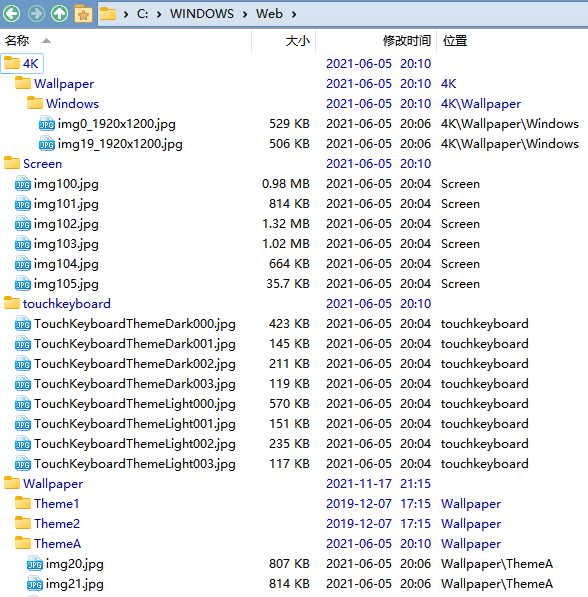
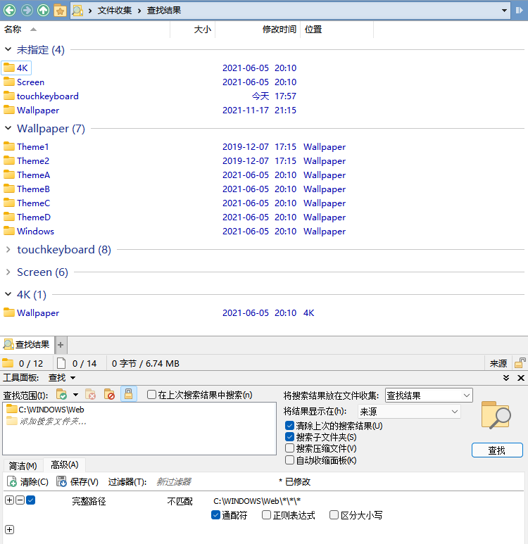

# 平面视图
平面视图可以同时显示出一个文件夹的所有子文件夹，如图：  

## 限制深度
DOpus 一直没有为平面视图提供限制深度的功能，目前只能通过文件集合和分组来有限地实现。

例如，如果我们要显示在 `C:\WINDOWS\Web` 下深度小于等于 1（`Web` 目录下的文件深度为 0）的文件，我们可以通过查找路径**不匹配** `C:\WINDOWS\Web\*\*\*`（或 `*\*\*\*\*\*`）的文件来实现。如图所示：  
  

除了通配符外也可以使用正则表达式：`C:\\WINDOWS\\Web\\(?:[^\\]+\\){2}`，其中 `2` 表示深度为 2。

### 可以实现一键限制深度吗？
可以，但并不简单。

Find 命令不支持直接匹配路径，虽然支持使用过滤器，但无法为过滤器指定参数。而脚本也无法调用查找功能。

即使退而求其次，把要求放宽到手动填写查找窗格，也因为查找无法匹配相对路径，免不了手动复制路径。虽然查找支持匹配脚本列，但查找在调用脚本列时，脚本列无法获取到查找路径（`scriptColumnData.tab.path` 为空，`DOpus.listers.lastactive.activetab.path` 为 `coll://查找结果`，`activetab.forwardlist` 也为空），因此也行不通。

唯一的途径只有通过脚本或外部程序自行枚举文件，再添加到文件集合进行显示。