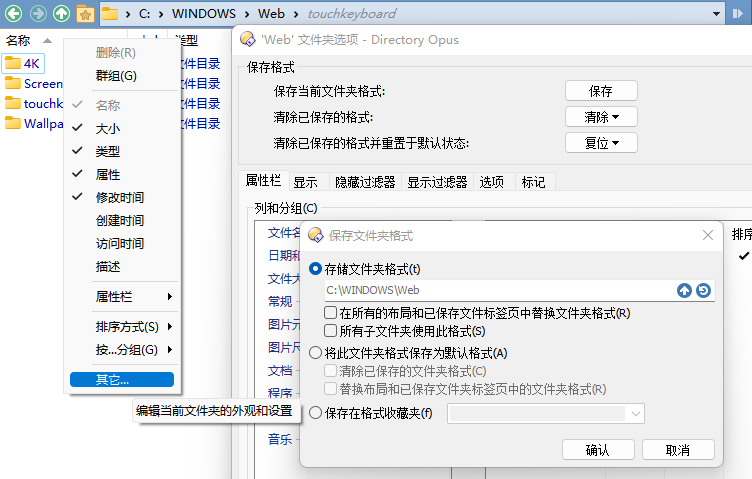
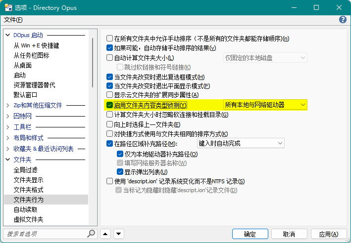

# 文件夹格式
文件夹格式决定了每个文件夹的显示格式，包括：
* [视图](视图.md)
* [列](列.md)
* [排序方式](排序.md)

  支持排序时混合文件与文件夹和手动排序。
* 分组方式
* 文件过滤器

  按照指定的规则隐藏或显示文件。
* 标记过滤器

  按照指定的规则为文件分配标记。
* 背景颜色
* 文件夹标签颜色

文件夹格式可按作用对象划分为六类：
1. [路径格式](#路径格式)
2. [通配符路径格式](#通配符路径格式)
3. 系统文件夹
4. [内容类型格式](#内容类型格式)
5. 文件夹类型格式
6. 默认格式

（按优先级排序）

你可以通过以下途径来配置文件夹格式：
- 配置窗口

   
- 文件列表的表头菜单

  

  注意，通过表头菜单修改文件夹格式**不会**自动保存，而是只对当前文件夹标签生效，保存需要手动点击“保存”按钮。

## 路径格式
路径格式只对特定的文件夹生效，也可包含文件夹的所有子文件夹。

需要注意的是，当文件夹被重命名时，DOpus **不会**自动更新相应的路径格式，需要手动进行更新。

## 通配符路径格式
通配符路径格式可以通过通配符或正则表达式对路径进行匹配，并对匹配的文件夹应用指定格式。

### 文件夹格式标签
路径格式存在着三个问题：
- 文件夹被重命名时不会自动更新
- 不同路径的文件夹无法复用格式
- 绝对路径导致难以同步格式配置

解决这三个问题的一种方法是使用“文件夹格式标签”，即将文件夹格式以标签的形式加入文件夹名中，再通过通配符路径格式进行匹配。

例如，我们可以建立通配符路径为 `*#图集*` 的通配符路径格式，并将文件夹重命名为 `文件夹XX #图集` 来应用图集格式。

## 内容类型格式
“内容类型”是指根据文件夹内容（[文件类型群组](../文件操作/文件类型.md#文件类型群组)的占比）所推测出的文件夹类型，“内容类型格式”是指对某个内容类型生效的文件夹格式。内容类型格式最典型的用途是在图片文件夹自动切换到缩略图视图。

需要注意的是，文件夹内容类型探测默认是关闭的，在使用内容类型格式时需要首先开启探测：

