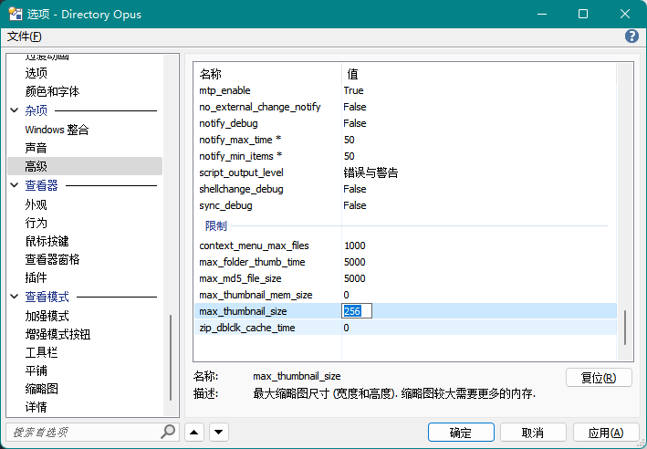
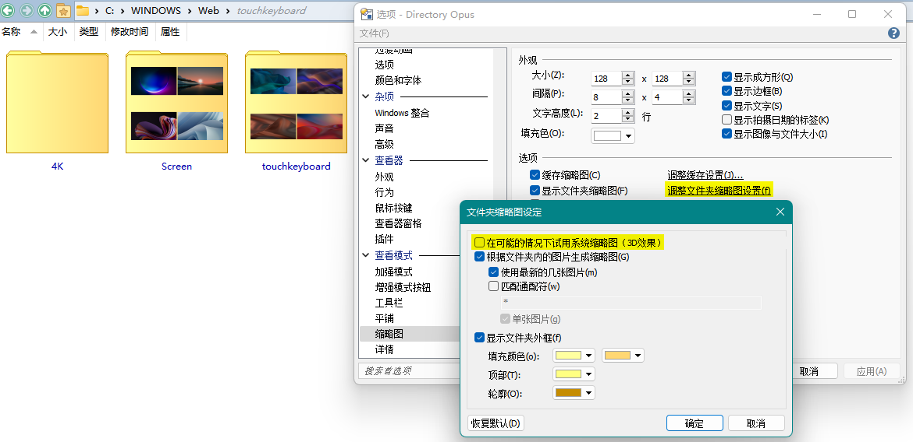
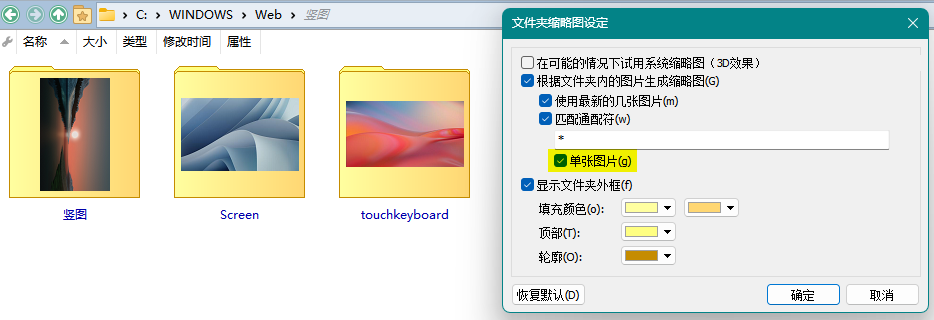

# 缩略图
## 如何调整缩略图的最大尺寸？
缩略图的最大尺寸默认为 256，可以通过在配置窗口中修改 `杂项/高级/限制/max_thumbnail_size` 来调整：

修改之后需要重启 DOpus 才能生效。

注意，最大尺寸越大，缩略图占用内存越多。

## 文件夹缩略图样式
DOpus 默认会使用系统的文件夹缩略图样式，在不同版本的 Windows 下会有不同的外观。

可以通过取消勾选 `配置/查看模式/缩略图/调整文件夹缩略图设置/在可能的情况下使用系统缩略图` 来启用内置样式：

`根据文件夹内的图片生成缩略图` 和 `显示文件夹外框` 这两项配置只会对内置样式生效。

勾选 `单张图片` 可以让缩略图只显示一张图片：

## [→如何让缩略图显示完整文件名？](视图.md#如何让缩略图图标和平铺视图显示完整文件名)