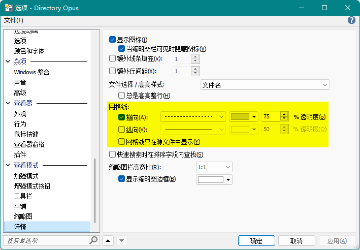
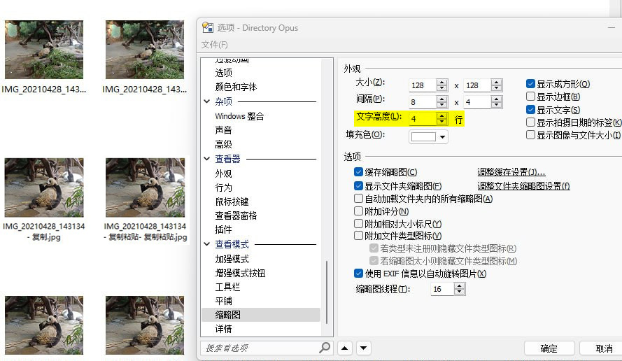

# 视图
- [详细](#详细视图)（默认）
- [增强模式](#增强模式)
- [缩略图](缩略图.md)
- 列表
- 小图标
- 大图标
- 平铺
- [平面视图](平面视图.md)

## 详细视图
详细视图以表格的形式显示文件夹内容，是 DOpus 的默认视图。

### 操作
鼠标操作：
动作 | 功能
--- | ---
左键单击 | 单选文件
Ctrl + 左键单击 | 多选文件
Shift + 左键单击 | 范围选中
左键双击 | 打开文件
中键单击 | 多选文件
右键单击 | 上下文菜单
框选 | 多选文件

键盘操作：
热键 | 功能
--- | ---
↑ ↓ | 移动选中

### 网格线
网格线可以在以下位置开启：
- `工具栏/菜单/文件夹/网格线`（`Set GRIDLINESH=toggle`）

  只对当前文件夹标签有效。
- `配置/查看模式/详细`：

  

## 增强模式
增强模式是详细视图的操作增强版。

鼠标操作（默认）：
动作 | 功能
--- | ---
左键单击 | 多选文件
左键双击 | 打开文件
中键单击 | 重命名文件
右键单击 | 上下文菜单（多选）
框选 | 反向选择文件

键盘操作：
热键 | 功能
--- | ---
↑ ↓ | 滚动列表 激活即时查找后：移动焦点

## 如何让缩略图、图标和平铺视图显示完整文件名？
在缩略图、大图标、小图标和平铺视图下，如果文件名在一定宽度内显示不下，DOpus 就会用“...”代替剩下的文件名，带来了一些不便。

缩略图的文件名行数可以在 `查看模式/缩略图/文字高度` 处设置，但大图标、小图标和平铺的文件名行数则无法设置。需要注意的是，即使增大了缩略图的文件名行数，也只有含有空格的文件名才能显示多行，不含空格的文件名仍然只能显示一行：

过长文件名的“...”省略无法关闭，但有三种绕过方法：
- 调整 `查看模式/缩略图/间隔`，增大第一个水平间隔，让每行显示更多字符
- 调整 `查看模式/缩略图/大小`（取消勾选 `显示成方形`），增加缩略图宽度，让每行显示更多字符
- 关闭 `显示/选项/试用视觉模式拖曳条目`（使用视觉样式绘制项目），这样在选中文件时就会显示完整文件名，但这也会导致选中变丑一些