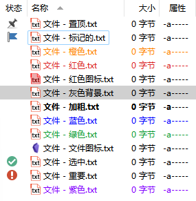
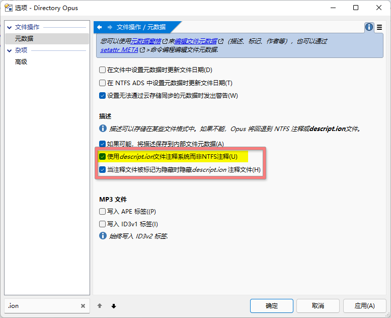
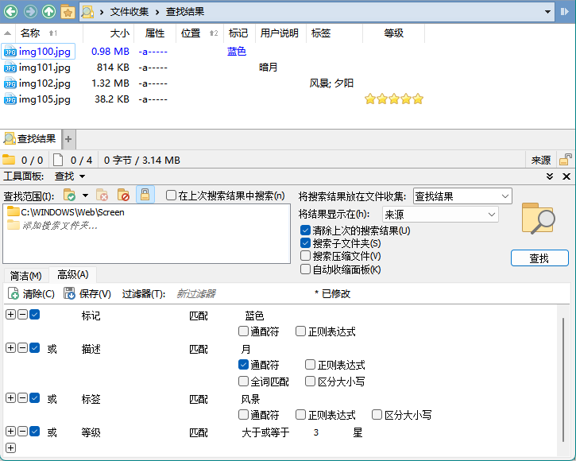
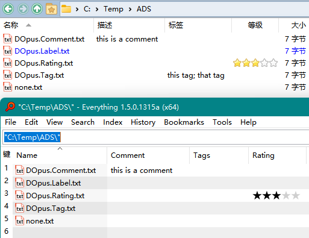
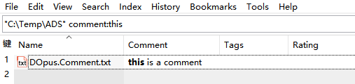

# 元数据
元数据是指描述文件自身的数据，每项数据称之为属性。

## 扩展属性
DOpus 有四项扩展属性：
- 标记（label）
- 描述（description）/备注（comment）
- 标签（tag）
- 评分（rating）

描述、标签和评分可以在设置元数据对话框（`工具栏/操作/属性/编辑元数据`，<kbd><kbd>Ctrl</kbd>+<kbd>M</kbd></kbd>）中编辑：


这四项扩展属性的储存位置如下：

元数据 | NTFS ADS | DOpus | 其它
--- | --- | --- | ---
标记 | `OpusMetaInformation` | `标记分配` (`foldercolors.oxc`)
描述 | `SummaryInformation` | ❌ | `descript.ion`
标签 | `OpusMetaInformation` | ❌
评分 | `OpusMetaInformation` | ❌

- 标签和评分只能储存在 NTFS ADS 中，因此只能用于 NTFS 中的文件。
- 标记除了储存到 NTFS ADS 外，还可储存到 DOpus 配置中，但在这种情况下重命名文件**不会**更新对应标记配置。
- 描述除了储存到 NTFS ADS 外，还可储存到相应文件夹下的 `descript.ion` 中，与 Total Commander 兼容。

### 标记


**标记**可以让文件以自定义的颜色显示，同时也支持设置文件图标和状态图标，设置加粗、斜体和下划线字体样式，以及将文件置顶。标记可以手动设置，也可以用标记过滤器自动分配。

### 描述
在 NTFS 下，DOpus 默认会将描述储存到 NTFS ADS 中。如果想要将描述储存到相应文件夹下的 `descript.ion` 文件中，需要勾选以下选项：



注意，在不勾选该选项时，即使文件夹中存在 `descript.ion`，DOpus 也不会读取。

在 DOpus 中，实际上有三种描述字段，它们间的区别如下[^user-description]：
- 描述（Description）：用户说明 + 其它信息（例如图像尺寸和格式）
- 用户说明（User Description）：NTFS ADS / `descript.ion`
- 注释（Comment）：文件类型元数据 / 用户说明

  如果一个文件类型支持注释元数据，那么即使该类型文件的元数据为空，DOpus 也不会显示用户说明。

可以将描述[加入到信息提示中](../文件列表/信息提示.md#提示内容)。

### 搜索
这四项扩展属性都可以通过查找窗格的高级模式进行搜索：


此外，Everything [v1.5.0.1276 以上](https://www.voidtools.com/forum/viewtopic.php?f=12&t=9787)也支持了搜索 DOpus 的描述、标签和评分 [^everything]，不过目前没有中文语言，只能使用 v1.4 的语言包汉化一部分界面。若要开启支持，需要在安装后按照以下步骤设置：

1. 在 Everything 搜索框中输入 `/opus_meta_information=1` 并回车，此时状态栏会显示 `opus_meta_information=1`
2. 输入 `/restart` 并回车来重启 Everything
3. 右键列表表头，在 `Add Columns...` 中添加 `Comment`、`Tags` 和 `Rating` 三列（注意不是 Windows Property System 中的 `标签` 和 `描述`），如图：

     
   （图中由于 DOpus 版本较旧，Everything 未能正确读取标签）

可以通过使用 `comment:` 、`tags:` 和 `rating:` 来搜索指定元数据（可以通过右键相应表头，选择 `Search for ...` 来自动输入相应前缀），例如：



另外，Everything 默认不会索引扩展属性，而是会在搜索时按需读取，如果想要建立索引可以手动在 `Options → Indexes → Properties` 中添加要索引的属性。

[^everything]: [Ability to Search Tags - voidtools forum](https://www.voidtools.com/forum/viewtopic.php?f=4&t=9877)

### 批量编辑
你可以通过 [Tagger](https://resource.dopus.com/t/tagger3-for-dopus12/24248) 对标签、描述和评分进行批量编辑：


此外，Tagger 也支持搜索标签、描述和评分（<kbd><kbd>Alt</kbd>+<kbd>F</kbd></kbd>）。

### 命令
#### 设置标记
```cmd
Properties SETLABEL=标记名
```
- 可通过 `ADDLABEL` 来表示增加标记，例如 `SETLABEL=标记名 ADDLABEL`。
- 可通过 `SETLABELTOGGLE` 来表示切换标记，例如 `SETLABEL=标记名 SETLABELTOGGLE`。

例子：

设为蓝色标记：
```cmd
Properties SETLABEL=蓝色
```

#### 设置描述
```cmd
SetAttr DESCRIPTION "描述"
```
或
```cmd
SetAttr META "comment:描述"
```

#### 设置标签
```cmd
SetAttr META tags:风景;夕阳
```
可通过 `+` `-` 来表示增减标签，例如 `tags:+风景;-夕阳` 表示增加 `风景` 标签，移除 `夕阳` 标签。

#### 设置评分
```cmd
SetAttr META rating:5
```


[^user-description]: [Comments, Description and User Description - why the same? - Help & Support - Directory Opus Resource Centre](https://resource.dopus.com/t/comments-description-and-user-description-why-the-same/20342?u=chaoses-ib)