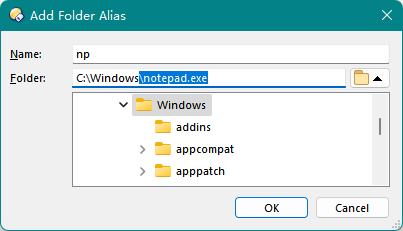
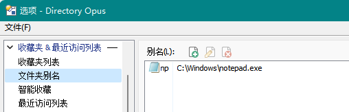

# 文件夹别名
## 文件夹别名能用于文件吗？
直接输入文件路径可以建立文件别名：  
  


## 命令
在命令中引用别名：`{alias|别名}`

设置和删除别名：
```cmd
Favorites ALIAS=set NAME=别名 "C:\Windows"
Favorites ALIAS=delete NAME=别名
```
注意，设置别名时不要使用 `PATH` 来指定路径，否则按钮会变为收藏夹动态列表。

## 脚本
添加、访问、修改和删除别名：
```js
DOpus.aliases.Add("别名", "C:\\Windows")
DOpus.Output(DOpus.aliases("别名").path)
DOpus.aliases.Update("别名", "C:\\")
DOpus.aliases.Delete("别名")
```

枚举别名：
```js
for(var ev=new Enumerator(DOpus.aliases); !ev.atEnd(); ev.moveNext()) {
	DOpus.Output(ev.item() + "=" + ev.item().path + (ev.item().system ? " (built-in)" : ""));
}
```