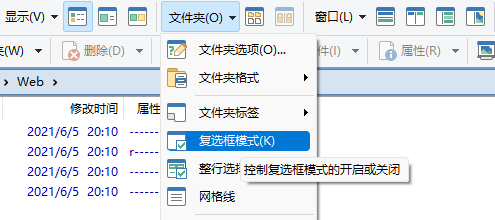
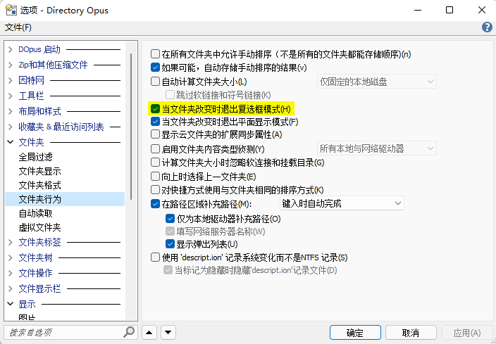
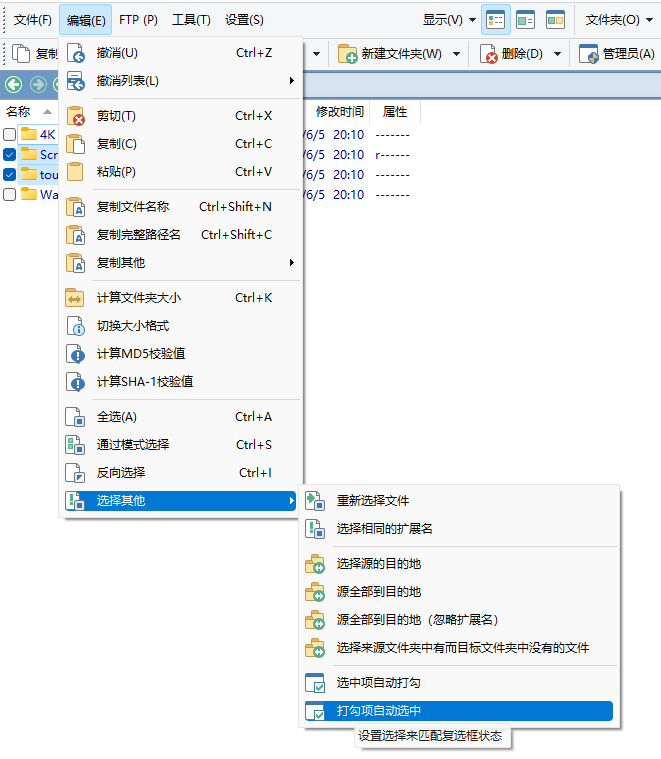

# 文件选择
## 选择文件
### 命令
显示选中文件（滚动到选中文件的位置）：
```cmd
Select THIS
```

取消选中所有文件：
```cmd
Select NONE
```

### [SelectEx](https://resource.dopus.com/t/command-selectex-extended-select-command/20517)
增强版 `Select` 命令，支持：
- 进入文件夹后自动选中指定文件
- 使用绝对路径选中文件
- 从剪切板、文件、变量加载列表，选中文件
- 保存或追加选中文件列表到剪切板、文件、变量
- 滚动到选中项目
- 随机选中
- 根据序号、大小、名称、类型进行线性选中
- 根据元数据进行选中
- 选中每 n 个项目

## 复选框模式
相较于选中文件，复选框模式更适合用于对文件进行复杂选择：
- 在选中文件时，如果没有在每次选中时按住 `Ctrl` 键，之前的选择都会被清除，而复选框模式没有这一问题；
- 使用选中文件时无法区分“浏览”与“选中”两个动作，浏览每个文件都会导致文件被选中，如果在浏览后发现并不希望选中当前文件，还要再取消选中。而在复选框模式下，只有勾选复选框或按下 `空格` 才会选中文件。

### 复选框模式的开关
复选框模式可以通过 `“菜单”工具栏 > 文件夹 > 复选框模式` 或 `Alt+O, K`（英文下为 `Alt+O, C`）来开启和关闭：



默认配置下，在切换文件夹时 DOpus 会自动关闭复选框模式，如果希望在切换文件夹时保留复选框模式，可以取消勾选 `配置 > 文件夹 > 文件夹行为 > 当文件夹改变时退出复选框模式`：



需要注意的是，关闭复选框模式并不会清除复选框勾选状态，在不切换文件夹的情况下再次开启复选框模式会恢复之前的勾选状态。如果不希望恢复勾选状态，可以将菜单中的 `复选框模式` 按钮的代码修改为：

```cmd
Set CHECKBOXMODE=toggle
Select NONE
```

另一种解决方案是，在关闭复选框模式时将勾选状态转化为选中，同时在开启复选框模式时将选中状态转化为勾选。这样做的好处是更加灵活，可以自行决定是否保留状态，同时也可以用于执行不支持复选框模式，只支持处理选中文件的操作，比如上下文菜单和拖放。代码如下：

```cmd
@if:Set CHECKBOXMODE=on
Select FROMCHECKS
Set CHECKBOXMODE=off
@if:else
// Set CHECKBOXMODE=on
Select TOCHECKS
```

### 复选框模式下的文件操作
当启用复选框模式时，被触发的按钮和快捷键会对**勾选的所有文件**执行操作（而不是选中的文件）。但要注意的是，上下文菜单仍然只对选中的文件执行操作。如果想要让上下文菜单对勾选的所有文件执行操作，可以先通过 `“菜单”工具栏 > 编辑 > 选择其他 > 打勾项自动选中` 选中所有文件，再触发上下文菜单进行操作：

