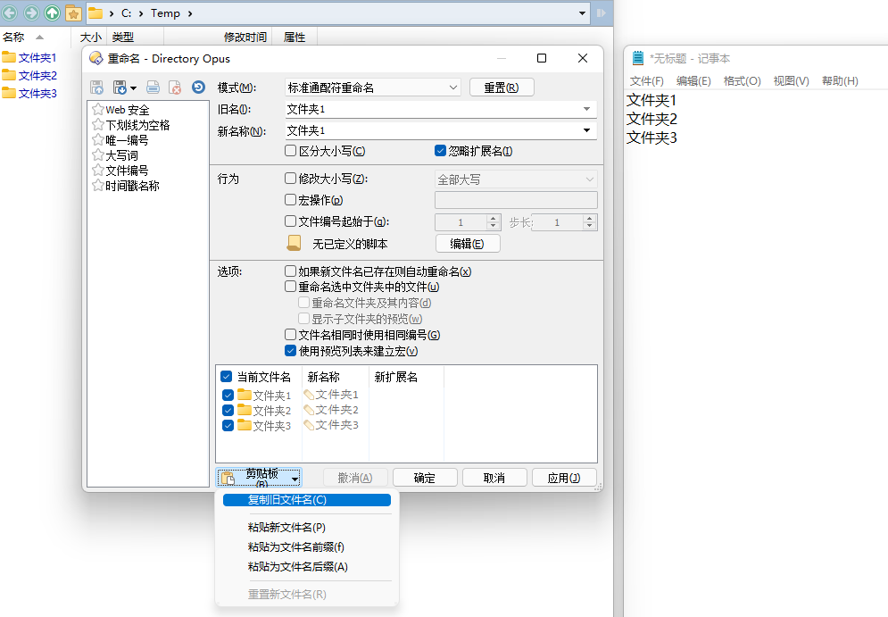
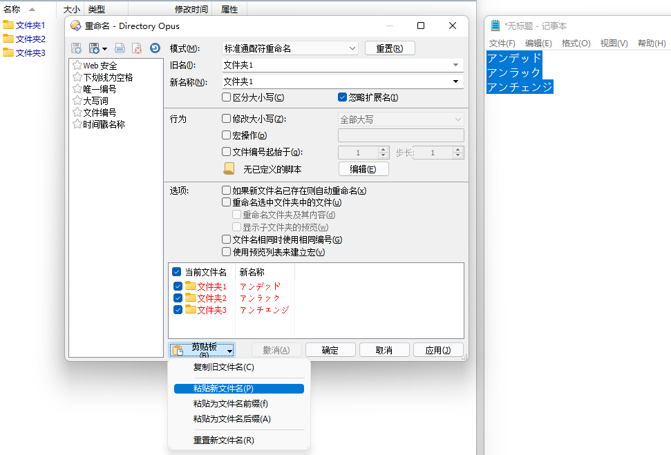
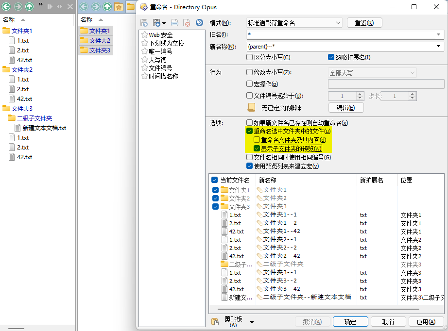
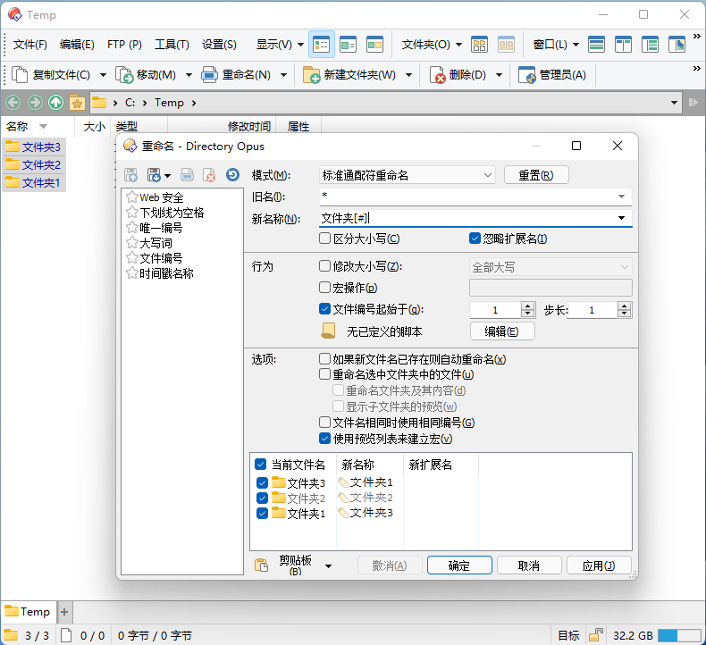

# 重命名
## 重命名对话框的默认状态
默认情况下，重命名对话框在打开时不会保留上次使用时的状态。通过对话框左上角的 `上次重命名` 按钮（<kbd>F4</kbd>）可以手动恢复上次状态。

如果希望对话框自动恢复上次状态，可以将相关按钮中的 `Rename ADVANCED` 命令替换为 `Rename ADVANCED PRESET=last`。

如果只希望修改默认模式，则可以替换为下列命令之一：
- 查找并替换：`Rename ADVANCED PRESET=findrep`
- 正则表达式：`Rename ADVANCED PRESET=regexp`
- 正则表达式 + 查找并替换：`Rename ADVANCED PRESET=regexpfindrep`

<details>

`regexpfindrep` 虽然在 v12.27 才被加入文档，但实际上在之前的版本中也是可用的。[^regexfindrep]

[^regexfindrep]: [Rename panel quirks - Help & Support - Directory Opus Resource Centre](https://resource.dopus.com/t/rename-panel-quirks/11777/5)

</details>

## 文本编辑器重命名
相较于其它方法，通过文件编辑器进行重命名更加灵活，可以组合手动编辑、查找替换、其它工具和脚本语言来进行处理。

DOpus 的重命名对话框支持导出文件名列表到剪贴板及导入，可以通过该功能实现文本编辑器重命名。例如：

1. 复制旧文件名

   

2. 编辑并粘贴新文件名

   

   除了直接从剪贴板导入文件名外，也可将剪贴板中的列表导入为文件名的前缀或后缀。

也可通过此功能实现交换两组文件的名称。

## 对选中文件夹中的文件进行重命名


在高级重命名中，选中“重命名选中文件夹中的文件”即可对选中文件夹中的文件进行重命名。可以使用一些字段来引用父文件夹的名称：

- 使用 `{parent}` 可以引用文件的父文件夹名，如上图所示；
- 使用 `{parent[数字]}` 可以引用多级父文件夹名，例如 `{parent2}` 可以引用父文件夹的父文件夹名；
- 使用 `{parentbase}` 可以引用选中文件夹的父文件夹，或者通过 `{parentbase[数字]}` 来引用多级父文件夹。
- 不过不能直接引用选中文件夹的名称。

需要注意的是，这个选项也会对选中文件夹中所有子文件夹的文件进行重命名，且不能关闭。

在 `Rename` 命令中，可以使用 [`RECURSE`](https://www.gpsoft.com.au/help/opus12/index.html#!Documents/Rename.htm:~:text=RECURSE) 来开启该递归模式，例如：
```cmd
Rename PATTERN * TO {parent}--* RECURSE
```

## 重命名脚本
- [PercentDecode](https://github.com/Chaoses-Ib/IbDOpusScripts/blob/main/Rename%20Scripts/PercentDecode.js)（百分号解码）

  解码百分号编码（URL编码），例如将 `%E4%BD%A0%E5%A5%BD` 解码为 `你好`。
- [EncodingConvert](https://github.com/Chaoses-Ib/IbDOpusScripts/blob/main/Rename%20Scripts/EncodingConvert.js)（编码转换）

  主要用于修复文件名乱码，例如将 GBK 编码的 `嬻偺嫬奅 椉媀幃` 修复为 Shift-JIS 编码的 `空の境界 両儀式`。

  

  支持 UTF-8、GBK、Big5、Shift-JIS 和 EUC-KR 编码。
- [中文数字转阿拉伯数字-WSQL](https://github.com/Chaoses-Ib/IbDOpusScripts/blob/main/Rename%20Scripts/%E4%B8%AD%E6%96%87%E6%95%B0%E5%AD%97%E8%BD%AC%E9%98%BF%E6%8B%89%E4%BC%AF%E6%95%B0%E5%AD%97-WSQL.vbs)

  例如将 `一百二十三` 转换为 `123`。支持大写数字。
- [阿拉伯数字转中文数字-WSQL](https://github.com/Chaoses-Ib/IbDOpusScripts/blob/main/Rename%20Scripts/%E9%98%BF%E6%8B%89%E4%BC%AF%E6%95%B0%E5%AD%97%E8%BD%AC%E4%B8%AD%E6%96%87%E6%95%B0%E5%AD%97-WSQL.vbs)

  例如将 `123` 转换为 `一百二十三`。支持大写数字。
- [阿拉伯数字转中文数字-无单位](https://github.com/Chaoses-Ib/IbDOpusScripts/blob/main/Rename%20Scripts/%E9%98%BF%E6%8B%89%E4%BC%AF%E6%95%B0%E5%AD%97%E8%BD%AC%E4%B8%AD%E6%96%87%E6%95%B0%E5%AD%97-%E6%97%A0%E5%8D%95%E4%BD%8D.js)

  例如将 `123` 转换为 `一二三`。支持大写数字。
- [中英混排加空格](https://github.com/Chaoses-Ib/IbDOpusScripts/blob/main/Rename%20Scripts/%E4%B8%AD%E8%8B%B1%E6%B7%B7%E6%8E%92%E5%8A%A0%E7%A9%BA%E6%A0%BC.js)

  在中英文之间添加空格，例如将 `你好world` 重命名为 `你好 world`。

## 批量重命名内部冲突
在批量重命名时，可能会出现某一文件的新名称与另一文件的旧名称冲突的情况，比如同时将 `文件夹1` 重命名为 `文件夹3`，将 `文件夹3` 重命名为 `文件夹1`。部分重命名工具无法正确处理这种情况[^冲突-小众]，但 DOpus 和 Total Commander 都可以正确处理：




[^冲突-小众]: [有更名软件能做到进行有冲突的文件夹更名操作吗？ - 问题求助❓ - 小众软件官方论坛](https://meta.appinn.net/t/topic/49983?u=chaoses_ib)