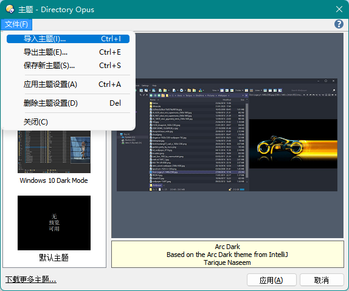
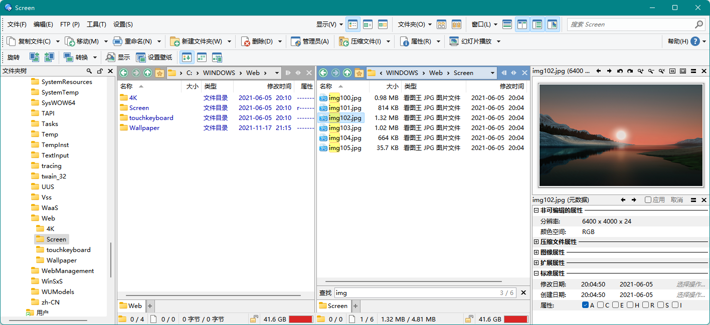

# 主题
## 导入主题
  
打开 `工具栏/菜单/设置/主题`，点击菜单栏 `文件/导入主题`，选择 `.dlt` 主题文件进行导入。导入后点击 `应用` 即可应用。

## 恢复默认主题
DOpus 没有直接提供恢复默认主题的功能，你可以采取以下几种方法来恢复：
- 在应用其它主题之前先保存默认主题（菜单栏 `文件/保存新主题`）
- 下载并导入 [默认主题](默认主题%20简体中文%20v12.23.dlt)
- [重置配置相应页中的设置](https://resource.dopus.com/t/plain-default-theme/1169)

## 深色模式
目前 DOpus [尚未支持](https://resource.dopus.com/t/respect-windows-system-light-dark-mode-switch-theme/36305) Windows 10 的深色模式。由于无法通过命令切换主题，也无法通过第三方程序实现，只能手动进行切换。

## 浅色主题
- [默认主题](默认主题%20简体中文%20v12.23.dlt)

- [Simple Line](https://resource.dopus.com/t/simple-line-light-style/31652)

- [Simple Light Theme](https://resource.dopus.com/t/simple-light-theme/26537)

- [Subtle light theme](https://resource.dopus.com/t/subtle-light-theme/40189)

- [Ecru light theme](https://resource.dopus.com/t/ecru-light-theme-one-of-very-few-here/40604)

- [Pickerel Explorer - revised](https://resource.dopus.com/t/pickerel-explorer-revised/40263)

- [Cyan](https://resource.dopus.com/t/cyan-only-color-and-font/29101)

- [Blue Theme](https://resource.dopus.com/t/blue-theme/40591)

## 深色主题
- [Simple Windows 10 Dark Theme](https://resource.dopus.com/t/simple-windows-10-dark-theme/30055)

- [Arc Dark Theme](https://resource.dopus.com/t/arc-dark-theme/35284)

- [Derwish Theme13](https://resource.dopus.com/t/derwish-theme13/33161)

- [Dark grey-blue](https://resource.dopus.com/t/dopus12-3-3-dark-grey-blue/24600)

- [NightOwl](https://resource.dopus.com/t/dopusnightowl-theme-based-on-the-vscode-theme-nightowl/34236)

- [根据 ConEmu 色调修改的保护眼睛主题](https://resource.dopus.com/t/conemu/40833)

- [Solarized Theme](https://resource.dopus.com/t/solarized-theme/36479)

- [Nord Dark Theme](https://resource.dopus.com/t/nord-dark-theme/26921)

- [Dark Green Theme](https://resource.dopus.com/t/dark-green-theme/30395)

- [Dark and Red and in My Head](https://resource.dopus.com/t/dark-and-red-and-in-my-head-theme/34520)

- [Brushed Chrome Dark](https://resource.dopus.com/t/do12-brushed-chrome-dark/24074)

- [Friendly dark theme](https://resource.dopus.com/t/friendly-dark-theme/27630)
