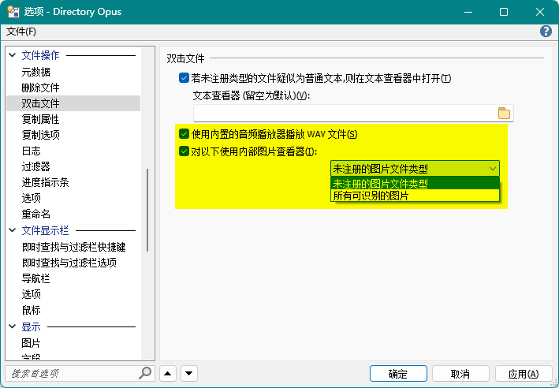

# 查看器
## 如何禁用内置查看器打开文件？
默认配置下，DOpus 会使用内置查看器打开所有图片文件和 WAV 文件，这一行为可以通过以下选项控制：

## 插件
### 文本
DOpus 自带的 Text 查看器插件默认支持以下编码：
- ANSI（GBK）
- UTF-8 with BOM
- UTF-16 LE

如果在配置中勾选 `以 UTF-8 无 BOM 编码`，则支持以下编码：
- UTF-8
- UTF-8 with BOM
- UTF-16 LE

由于 Text 插件不同时支持 ANSI 和 UTF-8，我们只能根据自己的常用编码进行取舍，在遇到乱码时再手动在配置中切换。

此外，如果你安装了 [PowerToys](https://github.com/microsoft/PowerToys) 并启用了 Monaco 预览，那么 DOpus 默认会使用 Monaco 来预览 `.txt`，它支持以下编码：
- UTF-8
- UTF-8 with BOM
- UTF-16 LE

由于 Monaco 预览加载较慢且无法预览 ANSI 编码文本，推荐在 `ActiveX + Preview + Office + Web` 查看器插件中移除 Monaco 的 `.txt` 扩展名，使用默认 Text 插件进行预览。