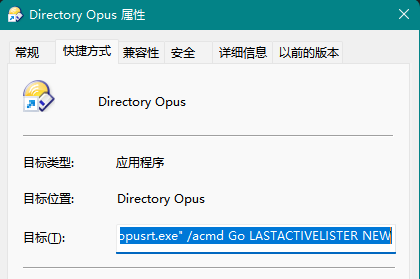

# 单窗口模式
DOpus 没有内置的单窗口模式，但可以通过一些配置来间接实现。

默认配置下，新文件窗口的产生有以下几个来源：
- 资源管理器替换
- 双击桌面
- 双击任务栏图标
- 热键
  - 全局
    - <kbd><kbd>Win</kbd>+<kbd>E</kbd></kbd>
    - <kbd><kbd>Win</kbd>+<kbd>Shift</kbd>+<kbd>E</kbd></kbd> 打开新窗口
  - 文件列表
    - <kbd>Shift</kbd>+双击 在新窗口中打开选中文件夹
  - 菜单工具栏
    - <kbd><kbd>Ctrl</kbd>+<kbd>E</kbd></kbd> 打开新窗口
- 工具栏
  - 菜单/文件/打开新窗口
- 启动 DOpus（运行 `dopus.exe`）

要实现单窗口模式，需要进行以下设置：
- 资源管理器替换

  勾选 `DOpus 启动/资源管理器替换/在新标签中打开外部文件夹`。
- 双击桌面

  选择 `DOpus 启动/从桌面/激活最近使用的窗口`。
- 双击任务栏图标

  选择 `DOpus 启动/从任务栏/激活最近使用的窗口`。
- 热键

  - Win+E
    - Windows 10 及以上：选择 `DOpus 启动/从 Win+E 热键/激活最近使用的窗口`，或设置 `运行命令` 为 `Go /mycomputer NEWTAB=findexisting,tofront`（打开我的电脑）。
    - Windows 10 以下：受资源管理器替换的配置控制，不需要单独设置。
  - 其它热键

    不使用、禁用或根据自己的需要修改。
- 工具栏

  不使用、删除或根据自己的需要修改。
- 启动 DOpus（可忽略）

  虽然无法直接禁止 `dopus.exe` 创建新窗口，但可以将指向 `dopus.exe` 的快捷方式的目标改为：
  - 在已有窗口中打开我的电脑：`"C:\Program Files\GPSoftware\Directory Opus\dopusrt.exe" /acmd Go /mycomputer NEWTAB=findexisting,tofront`
  - 激活最近使用的窗口：`"C:\Program Files\GPSoftware\Directory Opus\dopusrt.exe" /acmd Go LASTACTIVELISTER NEW`
  
  对于任务栏来说，可以先将 DOpus 固定到任务栏，再通过右键菜单修改快捷方式，或者直接定位到 `%APPDATA%\Microsoft\Internet Explorer\Quick Launch\User Pinned\TaskBar\Directory Opus.lnk` 进行修改：

  