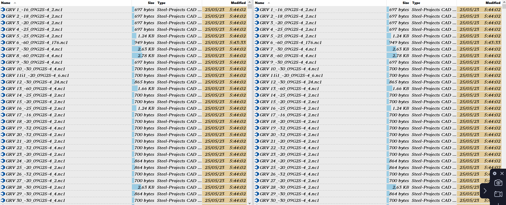

# 双栏
## 同步滚动
在 DOpus 中，按下 `Alt` 键即可同时滚动左右/上下双栏的文件列表，包括上下滚动和左右滚动（左右滚动需要触摸板或水平滚轮）。[^alt][^alt2]不过要注意这只是让双栏同时滚动相同的距离，而不是让双栏的滚动条位置同步。

[^alt-gif]

## 关联文件夹
你可以通过 [LinkedTab_AutoOpen_Handler](https://resource.dopus.com/t/linkedtab-autoopen-handler-open-related-folder-tabs-automatically/17850) 来关联两个文件夹，在打开其中一个文件夹时自动在对栏打开另一个文件夹：

[^alt]: [How to get scrolling in both panels of comparison results simultaneously - Help & Support - Directory Opus Resource Centre](https://resource.dopus.com/t/how-to-get-scrolling-in-both-panels-of-comparison-results-simultaneously/20984?u=chaoses-ib)
[^alt2]: [Sync Scroll bar in Find Duplicate + Split window? - Help & Support - Directory Opus Resource Centre](https://resource.dopus.com/t/sync-scroll-bar-in-find-duplicate-split-window/41170?u=chaoses-ib)
[^alt-gif]: [Lock Scroll for two listers? - Help & Support - Directory Opus Resource Centre](https://resource.dopus.com/t/lock-scroll-for-two-listers/44524/7?u=chaoses-ib)