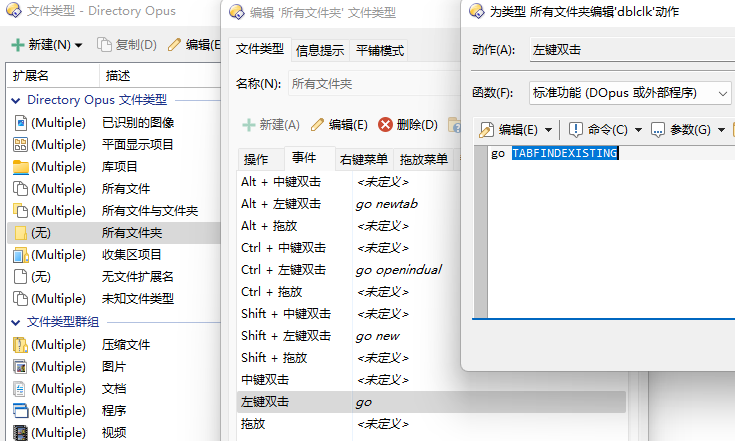
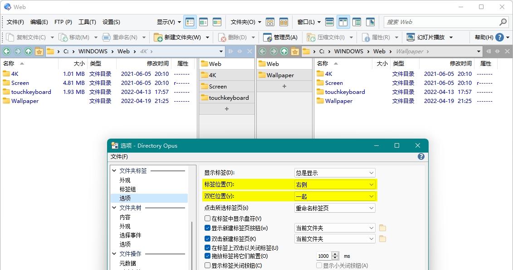

# 文件夹标签
## 激活已打开文件夹
默认情况下，DOpus 只会对通过资源管理器替换打开的文件夹进行检测，在已打开时直接激活相应标签页，未打开时才新建标签页。其它打开文件夹方式，例如在文件窗口内跳转、Win+E、双击桌面，都不会进行已打开检测。

如果你想要更激进的检测策略来避免频繁重复打开文件夹，可以在相应操作的 `Go` 命令中添加（或替换 `newtab` 为）以下任一选项：
- `NEWTAB=findexisting`（在未打开时新建标签页）
- `EXISTINGLISTER`（在未打开时直接跳转，检测所有文件窗口，且激活所有匹配标签页）
- `TABFINDEXISTING`（在未打开时直接跳转，检测范围仅限于当前文件窗口）

例如：
- 文件窗口中双击文件夹：

  

- 文件夹树：参考[^exist-tree]
- Win+E、双击桌面：参考[^exist-wine]
- [面包屑地址栏](../../导航/地址栏.md)：不可调整，不过可通过脚本监听事件间接实现

[^exist-tree]: [Open directory in new tab without duplicate? - Help & Support - Directory Opus Resource Centre](https://resource.dopus.com/t/open-directory-in-new-tab-without-duplicate/37043/21?u=chaoses-ib)
[^exist-wine]: [Opening a new default Folder Tab using (Win+E) keys - Help & Support - Directory Opus Resource Centre](https://resource.dopus.com/t/opening-a-new-default-folder-tab-using-win-e-keys/42872?u=chaoses-ib)

## 垂直排列
文件夹标签默认水平排列，如果想使用垂直排列，可以在 `配置/文件夹标签/选项/标签位置` 中选择 `左侧` 或 `右侧`：



设置 `双栏位置` 为 `一起` 可以让双栏状态下的文件夹标签显示在一起，即左栏在右侧显示，右栏在左侧显示；`分开` 可以让文件夹标签对立显示，即左栏在左侧显示，右栏在右侧显示。

## 文件夹标签名称
文件夹标签的默认名称为相应文件夹的名称。

如果打开了多个名称相同的文件夹，就会难以区分不同的文件夹。可以使用 [Tab-Labelizer](https://resource.dopus.com/t/tab-labelizer-extend-the-folder-names-shown-in-your-tabs/18075?u=chaoses-ib) 来自动为冲突的文件夹标签名称补充父路径：

使用前 | 使用后
--- | ---
 | 

此外，Tab-Labelizer 还支持通过自定义设置来将指定文件夹名替换为其它名称。

<!-- TODO: https://resource.dopus.com/t/tab-labelizer-plugin-to-assign-more-detailed-names-to-tabs/37275 -->

## 文件夹标签颜色
### 文件夹标记颜色
默认情况下，文件夹标签的颜色与文件夹的标记颜色是独立的[^color-1][^color-2]。如果想让文件夹标签默认使用文件夹的标记颜色，可以安装脚本 [TabColorizer](https://github.com/Chaoses-Ib/IbDOpusScripts/blob/main/README.zh-Hans.md#:~:text=%E7%BC%A9%E7%95%A5%E5%9B%BE%E5%B0%BA%E5%AF%B8%EF%BC%9A-,TabColorizer,-%E4%BD%BF%E7%94%A8%E6%96%87%E4%BB%B6%E5%A4%B9)：

使用前 | 使用后
--- | ---
 | 

[^color-1]: [DO12 - Tabs color - Help & Support - Directory Opus Resource Centre](https://resource.dopus.com/t/do12-tabs-color/22194?u=chaoses-ib)
[^color-2]: [Tab Color from Label Assignments - Help & Support - Directory Opus Resource Centre](https://resource.dopus.com/t/tab-color-from-label-assignments/23473?u=chaoses-ib)

### 命令
设置 RGB 颜色：
```cmd
Go TABCOLOR #ff8000
```
或
```cmd
Go TABCOLOR 255,128,0
```

重置颜色：
```
Go TABCOLOR=reset
```

## 关闭文件夹标签
### 关闭单个标签
命令：
```cmd
Go TABCLOSE=文件列表
```
默认为当前文件列表，`left` 为左栏，`right` 为右栏，`dest` 为目标文件列表。

例子：

关闭当前标签：
```cmd
Go TABCLOSE
```

### 关闭多个标签
命令：
```cmd
Go TABCLOSEALL=标签范围
```
默认为当前文件列表中的所有其它标签，`left` 为左侧所有标签，`right` 为右侧所有标签，`dest` 为目标文件列表的所有标签，`force` 为强制关闭锁定标签；可组合使用。

例子：

关闭当前文件列表中的所有其它标签：
```cmd
Go TABCLOSEALL
```

### 撤销关闭标签
命令：
```cmd
Go TABUNDOCLOSE
```