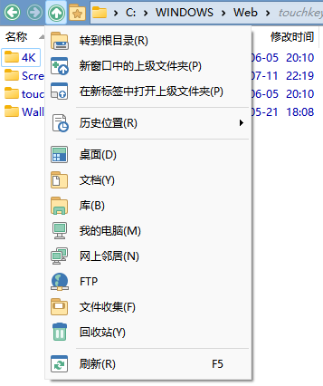
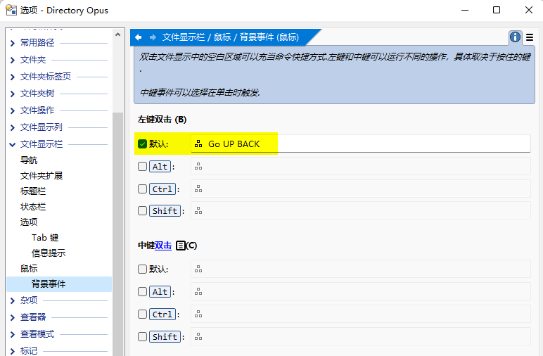

# 导航
## 向上


“向上”是指跳转到当前文件夹的父文件夹。左键单击上图所示的按钮可以进行向上，右键单击则会显示图中的跳转菜单（可以自定义）。除了使用上图中的按钮外也可以使用默认热键 <kbd>Backspace</kbd>（退格键）。<!-- TODO -->也可在配置中开启双击空白区域进行向上跳转：



向上跳转的命令为：
```cmd
Go UP BACK
```

## 前进和后退


“前进”和“后退”用于在浏览历史中移动。左键单击上图中的按钮可以分别进行后退和前进，右键单击则可以显示相应的历史列表。除了使用上图中的按钮外也可以使用默认热键 <kbd><kbd>Alt</kbd>+<kbd>←</kbd></kbd> 和 <kbd><kbd>Alt</kbd>+<kbd>→</kbd></kbd>。

## 跳转
### 命令
```cmd
Go PATH=跳转路径
```
参数名 PATH 可省略（`Go 跳转路径`）。

当跳转路径内含有空格时，需要在两边添加双引号。

例子：

跳转到剪贴板中的路径（目录或文件）：
```cmd
Go "{clip}"
```
只能用于纯文本路径，不能用于文件对象。

### 跳转到真实路径
命令：
```cmd
Go OPENCONTAINER=target
```

<details>

- OPENCONTAINER：文件集合、库、平面视图
  ```cmd
  Go OPENCONTAINER
  ```
- OPENCONTAINER：文件集合、库、平面视图、快捷方式、符号链接、junction
  ```cmd
  Go OPENCONTAINER=target
  ```
- {filepath}

  ```cmd
  @set a={filepath}
  Go {$a}
  ```
  如果不将 `{filepath}` 设置到变量，路径就不会被展开为真实路径。

  另一种展开方法是：
  ```cmd
  dopusrt.exe /open {filepath}
  ```
- 打开文件所在的位置

  ```cmd
  ContextMenu VERB="opencontaining" LOOKUP
  ```
  只能在新窗口打开。
</details>

## 文件夹别名
见 [文件夹别名](../导航/别名.md)。