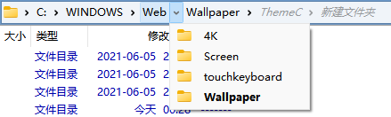
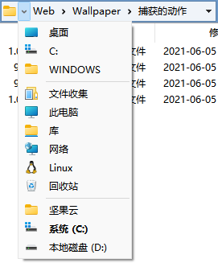

# 地址栏

面包屑地址栏中的每一个文件夹都可以点击，左键单击会跳转到相应文件夹，右键单击会显示上下文菜单，单击小箭头则会显示相应的所有子文件夹。除了点击外，你也可以直接向这些文件夹拖放文件。此外，访问过的子文件夹会显示为灰色，便于快速返回。

地址栏最左侧的小箭头具有不同的菜单：

除了显示一些常见位置外，如果当前路径太长它还会显示地址栏中未能显示的剩余地址，比如上图中的 `C:` 和 `WINDOWS` 两项。

如果要手动编辑地址，可以单击地址栏的空白位置或最左侧的文件夹图标，或者使用默认热键 <kbd>F4</kbd>。