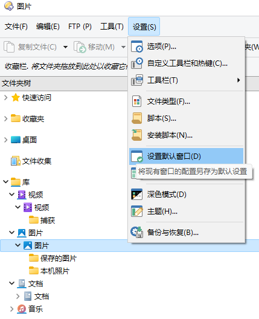

# 文件夹树
## 固定展开节点
在文件夹树中，DOpus 默认只会展开当前路径经过的节点，其它所有节点都是折叠的。

### 临时固定
如果想要临时固定展开某些节点，可在 文件夹树 → 展开/折叠 → 图钉 页面中启用 `文件夹树分支上的扩展图钉`：

之后在文件夹树中使用图钉钉住想要固定展开的节点：

图钉的状态在关闭窗口或重新打开文件夹树后就会丢失。

### 永久固定
想让图钉的状态永久保存，需要在 文件夹树 → 展开/折叠 页面中勾选 `记住所有展开的项目` 和 `仅当固定时记住`：

使用图钉固定想要展开的节点后，关闭窗口或手动设置默认窗口即可将图钉的固定状态保存到[默认窗口](../窗口/默认窗口.md)中。手动设置默认窗口的方法如下：

1. 点击 `设置默认窗口`：

   

2. 点击 `确定`：

   

另外，如果想让所有手动展开的节点都被记住，可以不勾选文件夹树配置页面中的 `仅当固定时记住`。由于 DOpus 默认会在关闭窗口时将要关闭的窗口保存为[默认窗口](../窗口/默认窗口.md)，这样设置会比较容易导致展开的节点混乱。

如果想让每个标签页有独立的展开状态，可以勾选 `记住标签页的展开项目`。