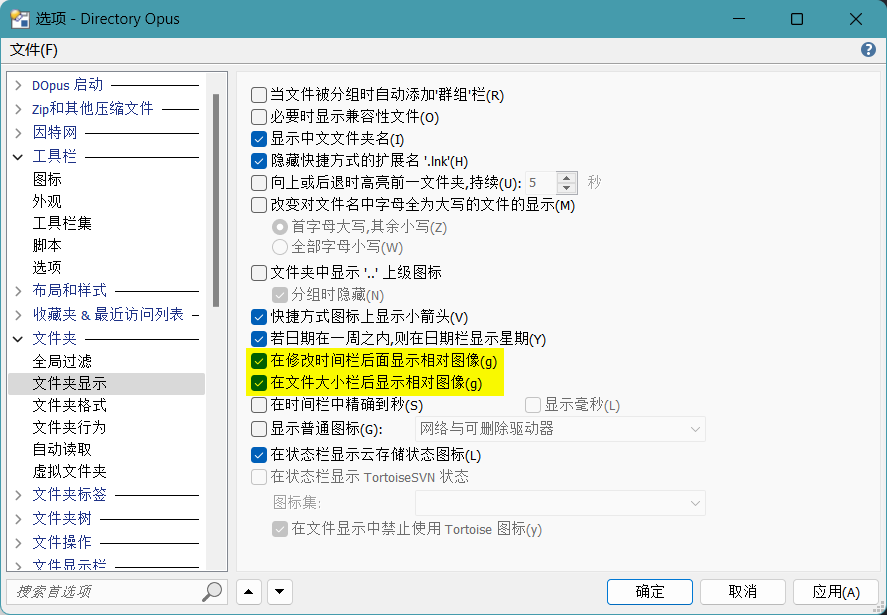

# 列
列通常是与文件相关的属性，例如文件名、大小和修改日期。除了这些基本属性之外，DOpus 也内置了备注、标签、星级这些常用的元属性，以及子文件数和 MD5 这样的计算型属性。DOpus 也为一些常见的文件类型内置了属性列，例如图片分辨率、视频时长、视频分辨率、视频帧率、音乐艺术家、音乐专辑、程序版本等等。除了这些内置列外，也可使用脚本和 Shell 的列处理器来实现自定义列。

## 列宽

列宽有五种选项：

选项 | 说明
--- | ---
自动 | 根据内容和列标题自动计算宽度
折叠 | 自动计算宽度，且在列表宽度不足时自动缩短
填充 | 占用列表剩下的所有宽度
展开 | 自动计算宽度，且置于折叠列或填充列右侧时不会影响它们的效果\*
固定 | 单位为像素

可通过 `最多` 来限制最大列宽（对填充和固定模式无效）。

\*：当展开列置于折叠列右侧时，如果列表宽度不足它会首先被截短，在它完全消失后折叠列才会开始缩短；当展开列置于填充列右侧时，只有向右滚动才能看到它。

## 行高
DO v12.8 以上可在 查看模式 → 详情 页中设置行高：

额外行内间距会导致行高增大，并且增大的区域算进项目内，可以点击选中，最大值 64 像素；而额外行外间距增大的区域算在项目外，不可点击，最大值为 9 像素。

## 条形图
DOpus 可以在大小列、修改时间列和创建时间列的下方显示条形图：

条形图默认不开启，若要使用，需要在配置窗口中勾选相应设置：

修改时间和创建时间的条形图默认是负时间轴的，即最旧的文件的最高，最新的文件最低。如果要改为正时间轴，可以在 `文件显示列/外观` 中勾选 `修改(相对图形)` 和 `创建(相对图形)` 的 `反转图形含义`：

效果对比：

不反转 | 反转
--- | ---
 | 

另外，条形图也可以作为单独的列使用：

v12

条形图默认不开启，若要使用，需要在配置窗口中勾选相应设置：

注意，修改时间列的设置项实际上对修改时间列和创建时间列都会生效。

修改时间和创建时间的条形图默认是负时间轴的，即最旧的文件的最高，最新的文件最低。如果要改为正时间轴，可以在 `显示/字段` 中勾选 `修改(相对）` 和 `创建（相对）` 的 `图片反转`（图表反转）：

## Everything 大小列
你可以通过 [IbDOpusExt](https://github.com/Chaoses-Ib/IbDOpusExt) 来从 [Everything](https://www.voidtools.com/) 即时获取索引的文件夹大小，并显示为列：

## 自定义列
你可以通过 [Custom Text and Regexp](https://resource.dopus.com/t/column-custom-text-and-regexp/18727?u=chaoses-ib) 从文件名中提取文本为列：

