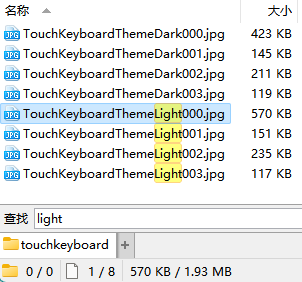
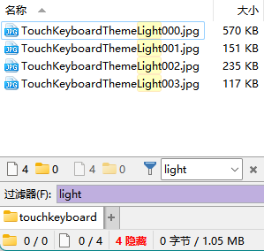
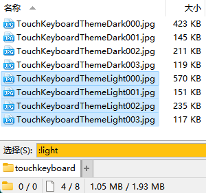

# 即时查找
**即时查找**功能可以实现即时查找或过滤文件；通过通配符或范围选择文件；跳转到其它路径或文件夹标签；以及执行 CLI 命令（<kbd>></kbd> 内置命令、<kbd>?</kbd> cmd 及 <kbd>|</kbd> WSL）。如图所示：

查找 | [过滤](#过滤--过滤器栏) | 选择 | 范围
--- | --- | --- | ---
 |  |  | 
搜索 | 跳转 | 标签页 | 命令
 |  |  | 

即时查找各个模式的激活键和颜色可以在 配置/过滤和排序/快捷键 页面中进行自定义：

即时查找的默认模式为查找。推荐改为[过滤](#过滤--过滤器栏)来只显示匹配的文件，更适合快速查找。

## 过滤 & 过滤器栏

上图中，上栏是过滤器栏，下栏是过滤模式。过滤和过滤器栏是两种不同的模式，不过两者功能有部分重叠，过滤模式默认也会联动过滤器栏。

过滤模式没有默认热键，过滤器栏默认热键为 `*`。可将默认模式改为过滤来使用过滤模式（或者分配其它热键）：

在过滤模式下，回车键默认只会选中文件，不会打开对应文件。推荐开启 `允许 Enter 键打开所选项目` 和 `选中第一个匹配项目`，匹配后按回车即可打开文件：

过滤器栏模式不支持该设置，只能先按回车完成编辑，选中文件，再按回车打开文件。

按 <kbd>Esc</kbd> 可退出过滤/过滤器栏模式，显示所有文件。

### 过滤器栏
可根据需要调整过滤器栏的设置：

- 显示过滤器栏 有三种选项：
  - 总是：不论是否激活过滤/过滤器栏模式，一直在文件列表底部显示过滤器栏
  - 每当设置过滤器时：激活过滤/过滤器栏模式时显示过滤器栏（默认）
  - 仅在编辑过滤器时：仅在激活过滤器栏模式时显示过滤器栏

- 忽略变音标记：默认关闭，可根据需要开启。

- 部分匹配：允许文件名只匹配输入的一部分。默认开启。