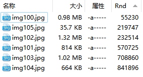

# 排序
## 随机排序
随机排序可以通过脚本手动排序和随机列两种方式来实现。

脚本手动排序：
- [Random Shuffle](https://resource.dopus.com/t/button-random-shuffle/23261)

  

  左键打乱所有文件和文件夹，右键重置。

  顺序会自动保存，但只有在开启手动排序时才会生效，如果需要保持乱序，可以在文件夹格式中开启手动排序并保存。

随机列：
- [Columns: CustomGrouping](https://resource.dopus.com/t/columns-customgrouping-group-by-sizerange-filetypegroup/19009)

  

  添加 CG.RandomNumber 列并按其排序即可实现随机排序，刷新或重新进入文件夹会重新排序。

  添加列后会影响当前标签页对所有文件夹的浏览，可以通过保存文件夹格式解决。