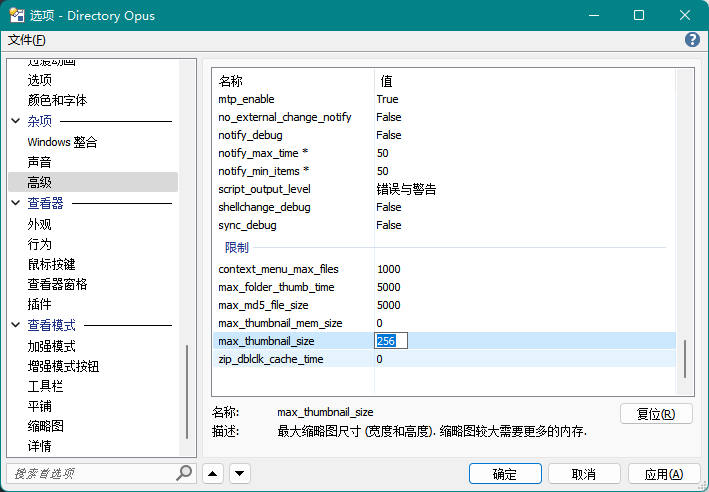
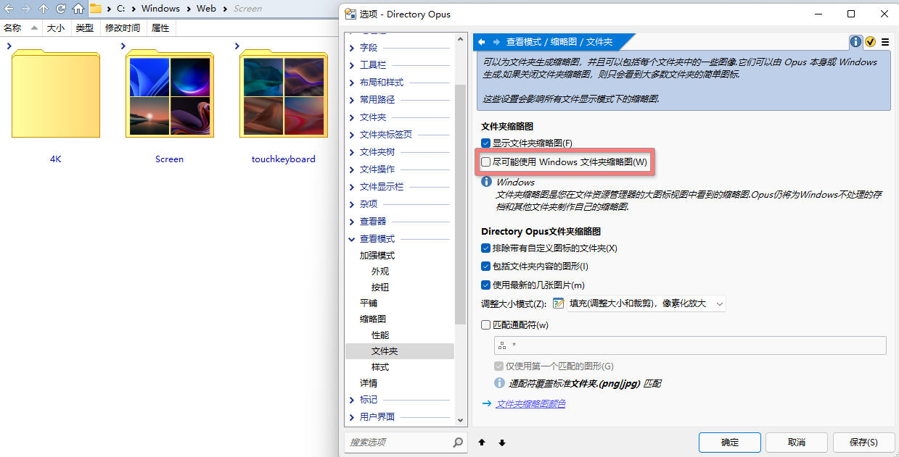
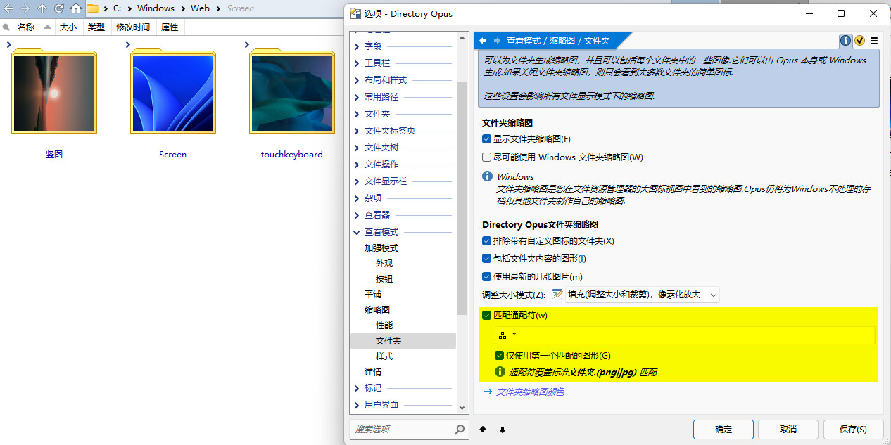
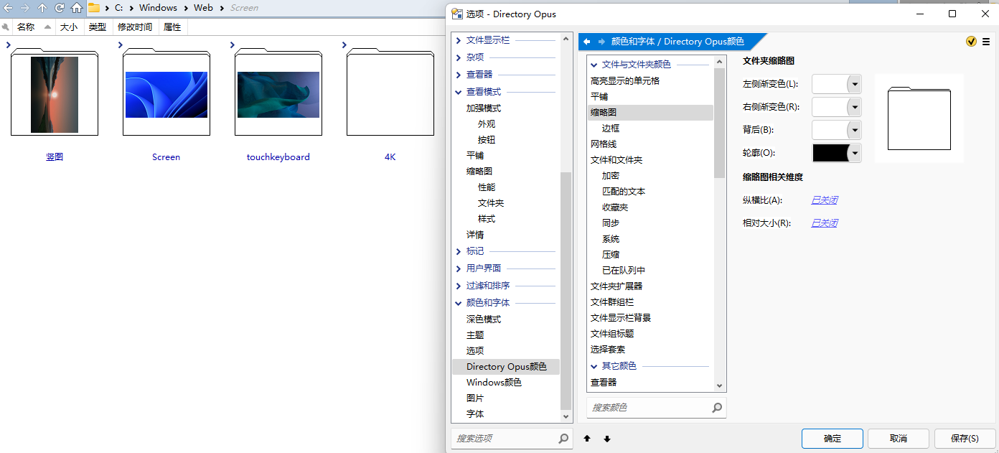

# 缩略图
## 如何调整缩略图的最大尺寸？
缩略图的最大尺寸默认为 256，可以通过在配置窗口中修改 `杂项/高级/限制/max_thumbnail_size` 来调整：

修改之后需要重启 DOpus 才能生效。

注意，最大尺寸越大，缩略图占用内存越多。

## 文件夹缩略图
DOpus 默认会使用系统的文件夹缩略图样式，在不同版本的 Windows 下会有不同的外观。

可以通过取消勾选 `配置/查看模式/缩略图/文件夹/尽可能使用 Windows 文件夹缩略图` 来启用内置样式：

勾选 `匹配通配符` 和 `仅使用第一个匹配的图形` 可以让缩略图只显示一张图片：

但是具体选取的图片只能通过通配符进行选择，按文件名升序排序，无法按修改时间排序来选取最近修改的图片。使用 `*` 作为通配符时会选取按文件名升序排序的第一张图片。

内置样式的边框不支持关闭，不过通过调整颜色到与文件列表背景色相同可以间接实现关闭（浅色模式和深色模式的配置是独立的）：

文件夹缩略图的默认调整大小模式为 `填充(调整大小和裁剪)，像素化放大`，会在图片比例和缩略图不符时裁剪图片。如果希望显示完整图片，可以修改模式为 `适配`。

v12

可以通过取消勾选 `配置/查看模式/缩略图/调整文件夹缩略图设置/在可能的情况下使用系统缩略图` 来启用内置样式：

`根据文件夹内的图片生成缩略图` 和 `显示文件夹外框` 这两项配置只会对内置样式生效。

勾选 `单张图片` 可以让缩略图只显示一张图片：

## [→如何让缩略图显示完整文件名？](README.md#如何让缩略图图标和平铺视图显示完整文件名)