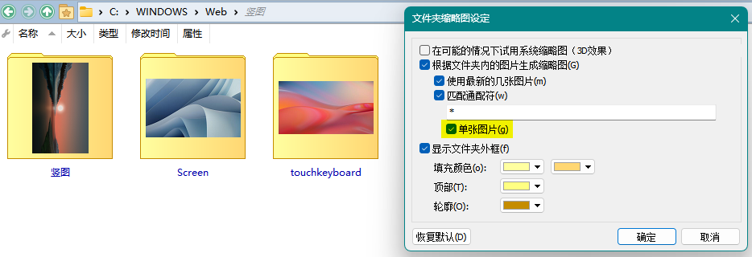

# 缩略图
## 缩略图最大尺寸
缩略图的最大尺寸默认为 256 像素，可以通过在配置窗口中修改 `杂项/高级/限制/max_thumbnail_size` 来调整：


修改之后需要重启 DOpus 才能生效。

注意，最大尺寸越大，缩略图占用内存越多。

## 缩略图比例
缩略图的默认显示比例是宽和高 1：1，如果图片的实际比例不是 1：1，就会导致缩略图出现空白，浪费屏幕空间。可以安装脚本 [SmartThumbnailSize](https://github.com/Chaoses-Ib/IbDOpusScripts/blob/main/README.zh-Hans.md#:~:text=%E8%84%9A%E6%9C%AC%E5%AF%B9%E8%B1%A1%E4%BF%A1%E6%81%AF%E3%80%82-,SmartThumbnailSize,-%E6%A0%B9%E6%8D%AE%E6%96%87%E4%BB%B6%E5%A4%B9) 来根据文件夹中的图片或选中的图片来自动调整缩略图比例：

使用前 | 使用后
--- | ---
 | 

## 文件夹缩略图
DOpus 默认会使用系统的文件夹缩略图样式，在不同版本的 Windows 下会有不同的外观。

可以通过取消勾选 `配置/查看模式/缩略图/文件夹/尽可能使用 Windows 文件夹缩略图` 来启用内置样式：


勾选 `匹配通配符` 和 `仅使用第一个匹配的图形` 可以让缩略图只显示一张图片：


但是具体选取的图片只能通过通配符进行选择，按文件名升序排序，无法按修改时间排序来选取最近修改的图片。使用 `*` 作为通配符时会选取按文件名升序排序的第一张图片。

内置样式的边框不支持关闭，不过通过调整颜色到与文件列表背景色相同可以间接实现关闭（浅色模式和深色模式的配置是独立的）：


文件夹缩略图的默认调整大小模式为 `填充(调整大小和裁剪)，像素化放大`，会在图片比例和缩略图不符时裁剪图片。如果希望显示完整图片，可以修改模式为 `适配`。

<details><summary>v12</summary>

可以通过取消勾选 `配置/查看模式/缩略图/调整文件夹缩略图设置/在可能的情况下使用系统缩略图` 来启用内置样式：


`根据文件夹内的图片生成缩略图` 和 `显示文件夹外框` 这两项配置只会对内置样式生效。

勾选 `单张图片` 可以让缩略图只显示一张图片：



</details>

其它软件：
- [如何实现XP那样的文件夹缩略图样式？ - 问题求助❓ - 小众软件官方论坛](https://meta.appinn.net/t/topic/32758)
- [如何批量给图片文件夹生成预览图 - 问题求助❓ - 小众软件官方论坛](https://meta.appinn.net/t/topic/60946)

## [→如何让缩略图显示完整文件名？](README.md#如何让缩略图图标和平铺视图显示完整文件名)

## 保存缩略图
<!-- TODO -->

尽管 DO 脚本支持调用 [`DOpus.LoadThumbnail()`](/Manual/reference/scripting_reference/scripting_objects/dopus.zh.md) 来加载文件/文件夹缩略图为 [`Image`](/Manual/reference/scripting_reference/scripting_objects/image.zh.md) 对象，但是 `Image` 只能保存到剪贴板，不能直接保存到文件。[^saveimage]并且将 `Image` 保存到剪贴板的方法 `Image.SetClip()` 实际上是坏掉的，无法正常调用：
```js
var img = DOpus.LoadThumbnail("C:\\Windows\\Web\\Screen")
DOpus.Output(typeof img)
// object
DOpus.Output(img.height)
// 256
img.SetClip()
// Error at line 4, position 1
// A method was called unexpectedly (0x8000ffff)
```

虽然 [`DOpus.SetClip()`](/Manual/reference/scripting_reference/scripting_objects/dopus.zh.md) 也能设置剪贴板，但是只支持文本和文件，不支持图像，所以还是无法通过脚本保存缩略图。

[^saveimage]: [Scripting : Save Image object to disk without using the clipboard - Help & Support - Directory Opus Resource Centre](https://resource.dopus.com/t/scripting-save-image-object-to-disk-without-using-the-clipboard/51377?u=chaoses-ib)