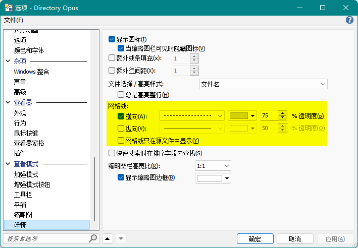

# 详细视图
详细视图以表格的形式显示文件夹内容，是 DOpus 的默认视图。

## 操作
鼠标操作：

动作 | 功能
--- | ---
左键单击 | 单选文件
<kbd>Ctrl</kbd> + 左键单击 | 多选文件
<kbd>Shift</kbd> + 左键单击 | 范围选中
左键双击 | 打开文件
中键单击 | 多选文件
右键单击 | 上下文菜单
框选 | 多选文件

键盘操作：

热键 | 功能
--- | ---
<kbd>↑</kbd> <kbd>↓</kbd> | 移动选中

## 网格线
网格线可以在以下位置开启：
- `工具栏/菜单/文件夹/网格线`（`Set GRIDLINESH=toggle`）

  只对当前文件夹标签有效。
- `配置/查看模式/详细`：

  

## 增强模式
增强模式是详细视图的操作增强版。

鼠标操作（默认）：

动作 | 功能
--- | ---
左键单击 | 多选文件
左键双击 | 打开文件
中键单击 | 重命名文件
右键单击 | 上下文菜单（多选）
框选 | 反向选择文件

键盘操作：

热键 | 功能
--- | ---
<kbd>↑</kbd> <kbd>↓</kbd> | 滚动列表 激活即时查找后：移动焦点
