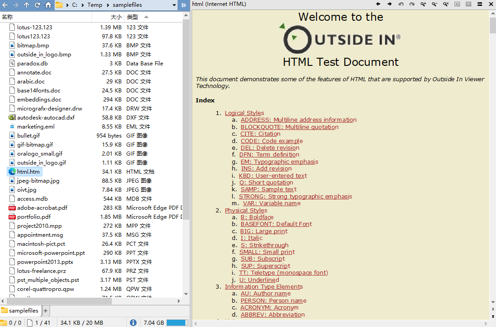
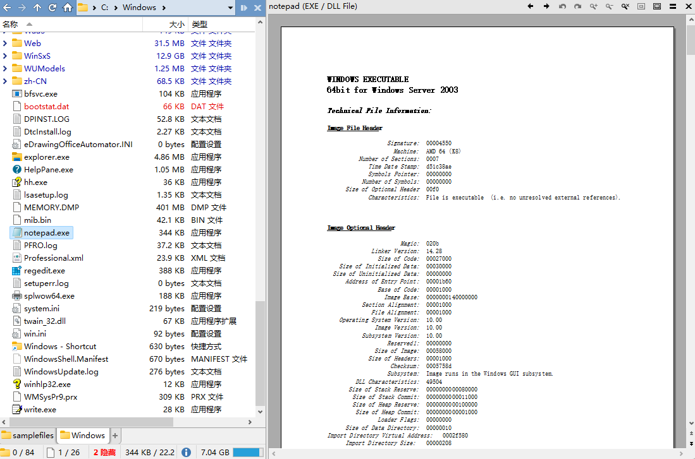
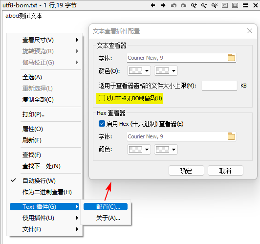

# 查看器
## 如何禁用内置查看器打开文件？
默认配置下，DOpus 会使用内置查看器打开所有图片文件和 WAV 文件，这一行为可以通过以下选项控制：

## 查看器窗格
默认情况下，查看器窗格只能显示于顶部工具栏的下方，不能最大化显示预览。可以使用 [MaxViewerPane](https://github.com/Chaoses-Ib/IbDOpusScripts/blob/main/README.zh-Hans.md#:~:text=%E8%BE%93%E5%87%BA%E4%BA%8B%E4%BB%B6%E4%BF%A1%E6%81%AF%E3%80%82-,MaxViewerPane,-%E6%9C%80%E5%A4%A7%E5%8C%96%E6%9F%A5%E7%9C%8B) 来手动最大化查看器窗格：

使用前 | 使用后
--- | ---
 | 

## 插件
### Oracle Outside In Viewer
[Oracle Outside In Viewer](https://docs.oracle.com/en/middleware/standalone/outsidein/8.5.4/viewer.html) 是由 Oracle 开发的文件预览库，支持预览超过 600 种文件格式。

可以通过以下步骤在 DOpus 中启用 Outside In Viewer 预览支持：

1. 下载 [Oracle Outside In Viewer](https://github.com/Chaoses-Ib/DirectoryOpus/releases)，解压到任意目录，例如 `/home/Viewers`。

   也可从[官网](https://www.oracle.com/middleware/technologies/outside-in-technology-downloads.html)进行下载，需要登陆 Oracle 账号。注意，不要下载 Active X 版本，否则将不能直接在 DOpus 中使用[^oracle-activex]。

2. 在配置窗口的 `查看器 → 插件` 页中启用内置的 MultiView 插件，并单击齿轮图标进行配置，定位到上一步解压出的 `Oracle Outside In Viewer` 目录。

   

Outside In Viewer 支持多种文档视图：

草稿视图 | 正常视图 | 预览视图（默认）
--- | --- | ---
 |  | 

默认的视图模式为预览，可以在预览窗格的右键菜单中调整为其它视图。推荐调整为正常视图，空间利用率更高。

一些 Outside In Viewer 支持预览的文件格式如下：
- 压缩包

  支持 ZIP、7z、RAR、CAB、TAR、GZIP，不支持分卷压缩包。

  

- 文档
  - TXT

    正常/草稿视图 | 预览视图
    --- | ---
     | 

  - Microsoft Word、WPS

    正常视图 | 预览视图
    --- | ---
     | 

    由于 MultiView 插件的优先级低于元插件，需要在配置中关闭元插件中的相应格式，或者在预览窗格中手动选择 MultiView 插件来使用。

  - PDF

    

    由于 MultiView 插件的优先级低于元插件，可能需要在配置中关闭元插件中的相应格式，或者在预览窗格中手动选择 MultiView 插件来使用。

  - RTF
  - XML
  - HTML

    

    由于 MultiView 插件的优先级低于元插件，需要在配置中关闭元插件中的相应格式，或者在预览窗格中手动选择 MultiView 插件来使用。

- 表格
  
  支持 Microsoft Excel、WPS。

  

  由于 MultiView 插件的优先级低于元插件，需要在配置中关闭元插件中的相应格式，或者在预览窗格中手动选择 MultiView 插件来使用。

- 幻灯片
  
  支持 Microsoft PowerPoint、WPS。

  

  由于 MultiView 插件的优先级低于元插件，需要在配置中关闭元插件中的相应格式，或者在预览窗格中手动选择 MultiView 插件来使用。

- 图片

  支持 BMP、PNG、JPEG、GIF、ICO、TIFF、SVG（仅 XML）、Adobe Photoshop PSD、Adobe Illustrator、Adobe InDesign、Microsoft Visio。

  可能需要在配置中将 MultiView 插件的优先级调整到其它图片插件之前，或者在预览窗格中手动选择 MultiView 插件来使用。

- 模型

  支持 AutoCAD。

  

- 邮件

  支持 Microsoft Outlook。

- 数据库
  
  支持 Microsoft Access、Paradox。

  

- 程序
  
  支持 EXE、DLL。

  正常视图 | 预览视图
  --- | ---
   | 

完整的支持格式列表见 [Oracle Outside In Technology Supported Formats](https://docs.oracle.com/en/middleware/standalone/outsidein/8.5/oit-supported-fileformats/OutsideIn_8.5.7_Supported_File_Formats.pdf)。

[^oracle-activex]: [Oracle Outside In, Viewer, 64 bit - Help & Support - Directory Opus Resource Centre](https://resource.dopus.com/t/oracle-outside-in-viewer-64-bit/32153)

### 文本
DOpus 自带的 Text 查看器插件默认支持以下编码：
- ANSI（GBK）
- UTF-8 with BOM
- UTF-16 LE

如果在配置中勾选 `以 UTF-8 无 BOM 编码`，则支持以下编码：
- UTF-8
- UTF-8 with BOM
- UTF-16 LE

由于 Text 插件不同时支持 ANSI 和 UTF-8，我们只能根据自己的常用编码进行取舍，在遇到乱码时再手动在配置中切换。

此外，如果你安装了 [PowerToys](https://github.com/microsoft/PowerToys) 并启用了 Monaco 预览，那么 DOpus 默认会使用 Monaco 来预览 `.txt`，它支持以下编码：
- UTF-8
- UTF-8 with BOM
- UTF-16 LE

由于 Monaco 预览加载较慢且无法预览 ANSI 编码文本，推荐在 `ActiveX + Preview + Office + Web` 查看器插件中移除 Monaco 的 `.txt` 扩展名，使用默认 Text 插件进行预览。