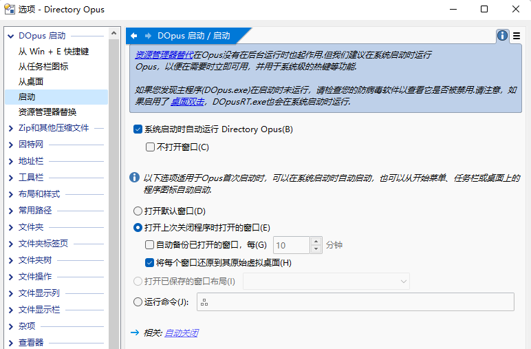
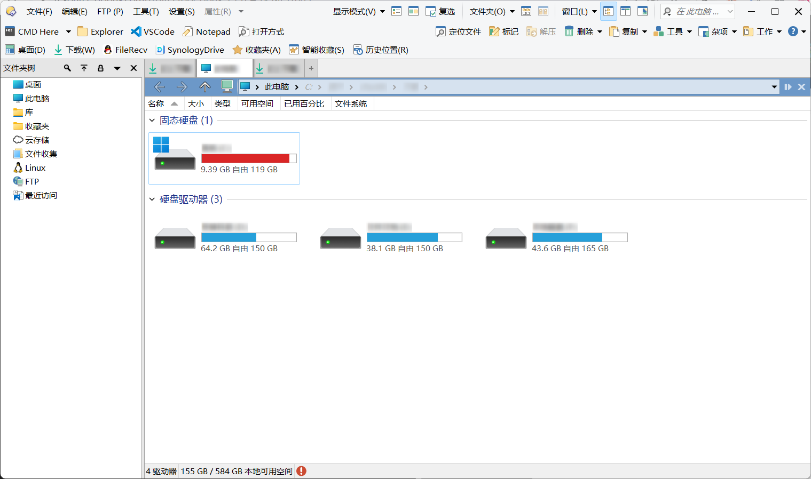
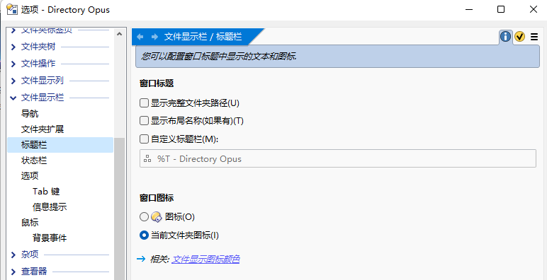
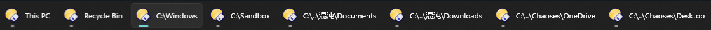
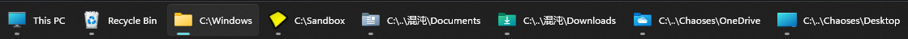
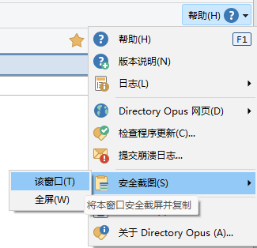
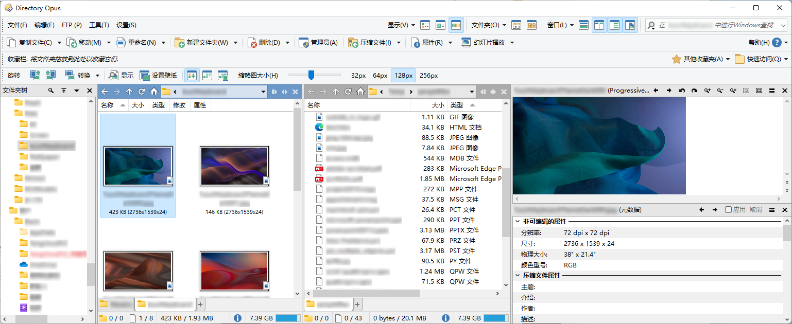

# 文件窗口


文件窗口由文件列表、[文件夹标签](../多文件夹/标签页/README.md)、状态栏、[工具栏](工具栏/README.md)、文件夹树和其它窗格组成。除了必须保留一个文件列表外，文件窗口中的所有其它组件都可移除。

## 新建与关闭
### 如何实现单窗口模式？
见 [单窗口模式](../多文件夹/单窗口模式.md)。

### 如何在关闭最后一个标签页时直接关闭窗口？
在配置窗口中勾选 `文件夹标签/选项/关闭最后的标签页时同时关闭窗口`。或者也可以使用脚本实现：[IbDOpusScripts/CloseTabOrLister](https://github.com/Chaoses-Ib/IbDOpusScripts/blob/main/Buttons/CloseTabOrLister.js)。

### 恢复关闭的窗口
DOpus 默认会在启动时自动恢复上次关闭时打开的窗口，并且支持恢复到原虚拟桌面。不过，DOpus 默认只会在正常关闭时保存窗口状态，在崩溃或强制关机的情况下窗口状态都会丢失，无法恢复。可以通过勾选 `自动备份已打开的窗口` 来实现定时备份，以便在崩溃后进行恢复。



另外，只有通过设置为 `打开默认窗口` 的启动方式进行启动时 DOpus 才会恢复上次的窗口，通过资源管理器替换或其它修改了设置的启动方式启动时只会打开对应的文件夹，不会恢复上次的窗口。在这种情况下，可以立即通过任务管理器强制结束 DOpus 并重新启动来触发恢复。

打开窗口状态储存在 `/dopuslocaldata/State Data/openlisters.oll` 文件中。

## 标题栏
DO v13.6.4 以上支持[将顶部工具栏移至窗口标题栏中](工具栏/README.md#将顶部工具栏移至窗口标题栏中)：



## 图标
在资源管理器中，文件窗口的任务栏图标会随当前文件夹的图标而变化。与资源管理器不同，DOpus 文件窗口的任务栏图标默认固定为 。推荐在配置中改为使用当前文件夹的图标，便于区分：



 图标：



当前文件夹图标：



另外，当前文件夹图标只会在 DOpus 的任务栏按钮未被合并时生效，在按钮被合并时仍会显示为 。

## 安全截屏
DOpus 支持对文件窗口进行“安全截屏”，即在截屏时自动对文件名进行打码。默认的安全截屏按钮位于 `操作工具栏 → 帮助 → 安全截图`：



效果图：



该按钮的相应命令为：
```cmd
Clipboard SCREENSHOT=secure
```

该命令会在截屏时播放快门声，同时弹窗进行提示。如果不希望弹出提示，可以将按钮的命令改为：

```cmd
Clipboard SCREENSHOT=secure,quiet
```

另外，也可以添加截屏倒计时，便于截取菜单之类的弹出式界面：
```cmd
Clipboard SCREENSHOT=secure,time:5
```

如果只希望对文件窗口进行截屏而不进行打码，可以去掉以上命令中的 `secure` 参数。