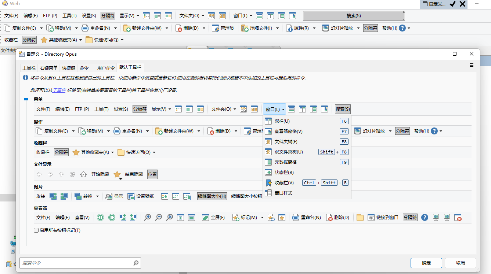
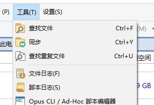
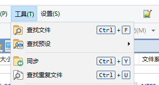
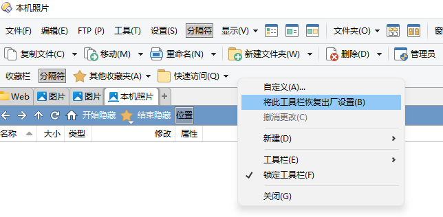

# 工具栏
## 导入按钮
导入按钮有拖放文件和粘贴代码两种方法：
- 拖放文件：通过 设置→自定义工具栏 或 右键工具栏空白处→自定义 进入自定义模式，将 .dcf 文件拖放到工具栏上即可。

  

- 粘贴代码：复制按钮代码（XML 格式），进入自定义模式，右键工具栏空白处→粘贴。

## 一个文件窗口显示哪些工具栏是如何决定的？
<!--激活途径-->

按以下各配置进行叠加：

1. 默认工具栏组
   
   需要注意的是，默认工具栏组在 `配置/工具栏/工具栏组` 中是看不到的，只能通过 `工具栏上下文菜单/工具栏/设置为默认工具栏组` 进行修改：

   
2. [文件夹格式](../../查看/文件夹格式.md)

   除了文件夹类型格式和默认格式外，每个文件夹格式可以指定激活一个工具栏或工具栏组。默认的所有文件夹格式都不会激活工具栏。
3. [视图](../../查看/列表/视图/README.md)
   
   每个视图也可以指定激活一个工具栏或工具栏组，配置位于 `配置/查看模式/工具栏`。默认配置下，只有缩略图会自动激活 `图片` 工具栏。
4. `工具栏上下文菜单/工具栏`，勾选目标工具栏或工具栏组
   
   只对当前文件窗口有效，不具有持久性。

此外，独立查看器只会显示 `配置/查看器/外观/工具栏` 指定的工具栏（默认为 `图片查看器` 工具栏），不受其它配置影响。

## 工具栏升级问题
DOpus 不支持在升级时自动更新旧版工具栏，新版新增/调整的按钮需要手动从自定义窗口的默认工具栏中添加（拖放到旧工具栏）：

在从 DOpus v12 升级到 v13 时，除了新增的按钮，还有一个变化是按钮显示热键不再需要在标题中手动插入热键（例如 `查找文件\tCtrl+F`），而是可以自动显示。但由于 DOpus 不支持升级工具栏，旧版工具栏并不会使用自动显示，导致从 v12 升级 v13 后的工具栏显示效果与全新 v13 不同：

v12 升级 v13 | 全新 v13
--- | ---
 | 

对于这种升级变化较多的情况，一个个拖动更新比较麻烦，可以考虑先备份自己的按钮到新建工具栏，再将每个内置工具栏都恢复出厂设置来实现更新：

