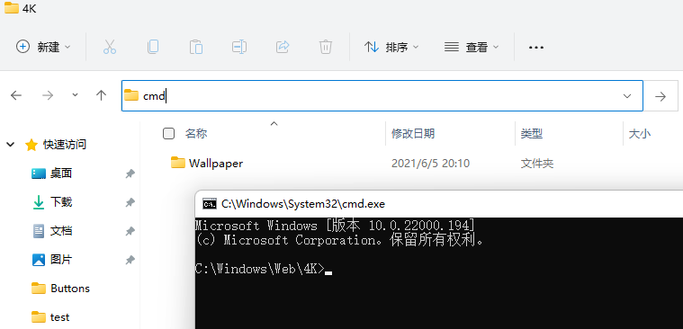
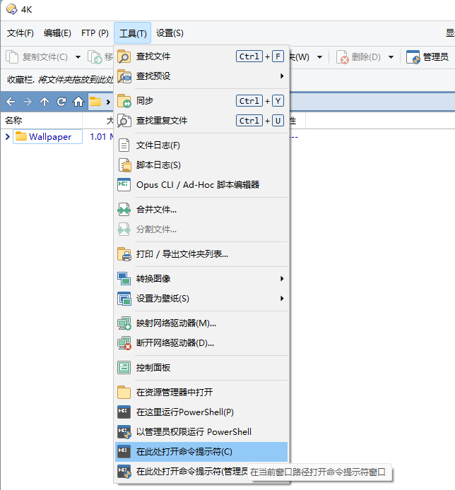
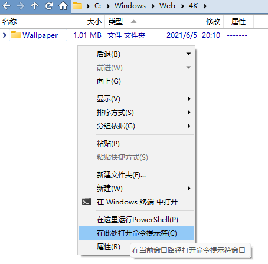
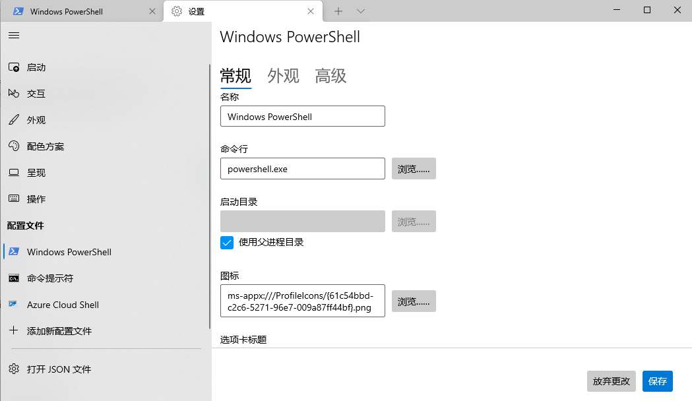

# 终端
在资源管理器中，在地址栏中输入相应命令行后回车即可执行。执行 `cmd` 就可以在当前目录打开终端：

DOpus 中不支持这样操作，而是需要使用[即时查找](查看/列表/即时查找.md)的命令模式，即先输入 <kbd>></kbd> 激活命令模式，再输入命令行执行：

除了使用 <kbd>></kbd> 激活内置命令模式外，还可以使用 <kbd>?</kbd> 激活 cmd 命令模式，以及使用 <kbd>|</kbd> 激活 WSL 命令模式。这些命令模式的激活键和颜色可以在 配置/过滤和排序/快捷键 页面中进行自定义：

除了使用即时查找外，也可以使用 DOpus 在工具栏和文件夹的上下文菜单中预置的选项来打开终端：

工具栏 | 文件夹上下文菜单
--- | ---
 | 

注意，如果你正在使用 [Windows Terminal](https://github.com/microsoft/terminal)，以上操作在默认情况下都不会在当前目录打开终端，而是会在 `%USERPROFILE%` 下打开[^wt]。要在当前目录打开需要在设置中为各个配置勾选 `使用父进程目录`： 

<!-- `Use parent process directory`
 -->

[^wt]: [Windows Terminal: Open terminal in current folder via single command - Issue #620 - microsoft/terminal](https://github.com/microsoft/terminal/issues/620)