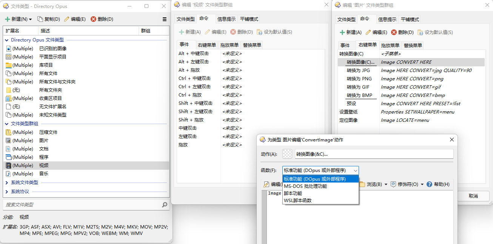
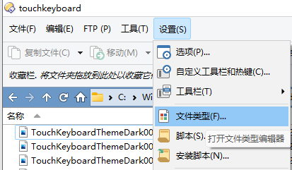
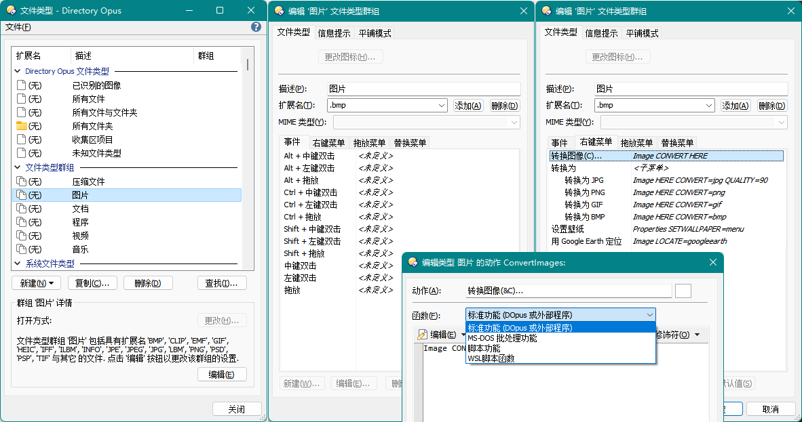
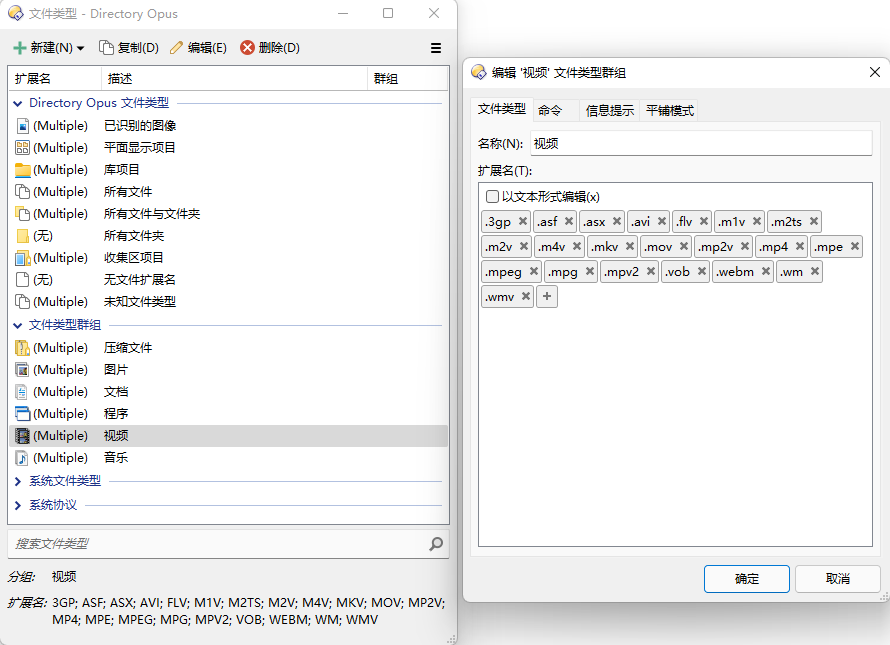
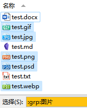
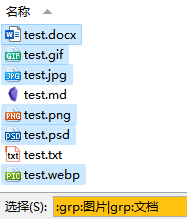

# 文件类型
在 DOpus 中，你可以为每个文件类型定义自己的鼠标动作、右键菜单和[信息提示](../浏览/查看/信息提示.md)。除了独立的文件类型外，DOpus 还有下图中的特殊文件类型和[文件类型群组](#文件类型群组)，便于同时为一组文件类型定义动作：



文件类型编辑器可通过工具栏打开：



<details><summary>v12</summary>


</details>

## 文件类型群组


### 如何批量编辑文件类型群组中的类型？
DOpus v13 中可直接在文件类型编辑器中以文本形式编辑。

也可以使用文本编辑器直接编辑 `/dopusdata\FileTypes\Groups\groups.oxr` 文件，格式为 XML：
```xml
<?xml version="1.0" encoding="UTF-8"?>
<xml_registry_redirect hive="HKCU" regkey="Software\GPSoftware\Directory Opus\Filetypes\Groups">
	<value name="DoneDef" type="dword">6</value>
	<value name="DoneDef_ImagesLocate" type="dword">1</value>
	<value name="DoneDef_ImagesSaveAs" type="dword">1</value>
	<key name="Images">
		<value name="@default" type="sz">图片</value>
		<value name="Members" type="sz">.jpg .jpe .jpeg .gif .png .iff .ilbm .lbm .bmp .info .tif .tiff .psd .psp .wmf .emf .clip .webp .heic</value>
		<key name="opusflags">
...
```

### 如何在通配符中匹配文件类型群组？
```
grp:文件类型群组名称
```

例如：

 

## 信息提示
见 [信息提示](../浏览/查看/信息提示.md)