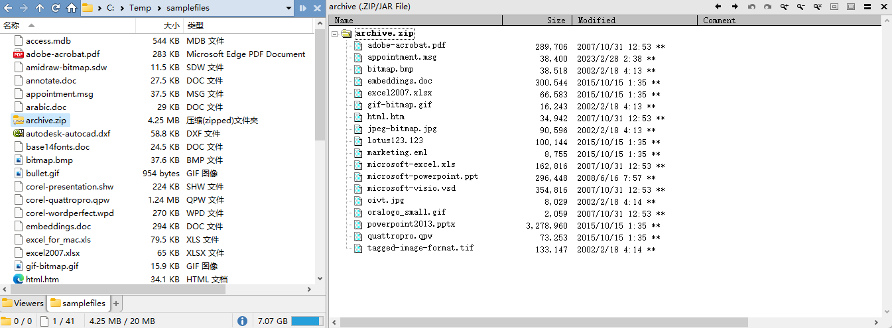

# 压缩包
## 预览
### [MultiView 插件](../浏览/查看/查看器.md#oracle-outside-in-viewer)
支持 ZIP、7z、RAR、CAB、TAR、GZIP，不支持分卷压缩包。

## 智能解压
### [Smart archive extraction](https://resource.dopus.com/t/smart-archive-extraction-enhanced/40637)
- 当压缩包根目录下只含有一个文件时直接解压，否则解压到一个文件夹
- 可选择双栏时解压到哪一栏
- 可选择解压后删除压缩包

### [AutoExtract](https://github.com/Chaoses-Ib/IbDOpusScripts/blob/main/Buttons/AutoExtract.js)
当压缩包根目录下只含有一个文件时直接解压，否则解压到一个文件夹。