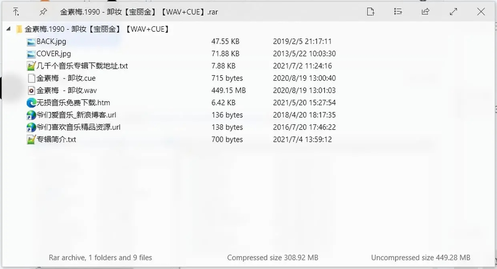

# 压缩包
## 智能解压
### [SmartExtract](https://github.com/Chaoses-Ib/IbDOpusScripts/blob/main/Buttons/SmartExtract.js)
对于选中的压缩包，当压缩包根目录下只含有一个文件/目录时直接解压，否则解压到同名文件夹。
- 支持多选
- 支持选中解压出的文件/文件夹

### [Smart archive extraction](https://resource.dopus.com/t/smart-archive-extraction-enhanced/40637?u=chaoses-ib)
- 当压缩包根目录下只含有一个文件时直接解压，否则解压到一个文件夹
- 可选择双栏时解压到哪一栏
- 可选择解压后删除压缩包

## 预览
### [MultiView 插件](../浏览/查看/查看器.md#oracle-outside-in-viewer)
支持 ZIP、7z、RAR（不支持 RAR5）、CAB、TAR、GZIP，不支持分卷压缩包。

### [QuickLook](../浏览/查看/查看器.md#quicklook)
支持 .zip、.rar、.tar.gz、.7z 等。

效果图：[^appinn]

[^appinn]: [在预览窗格看压缩文件 - 问题求助❓ - 小众软件官方论坛](https://meta.appinn.net/t/topic/54213/3?u=chaoses_ib)
