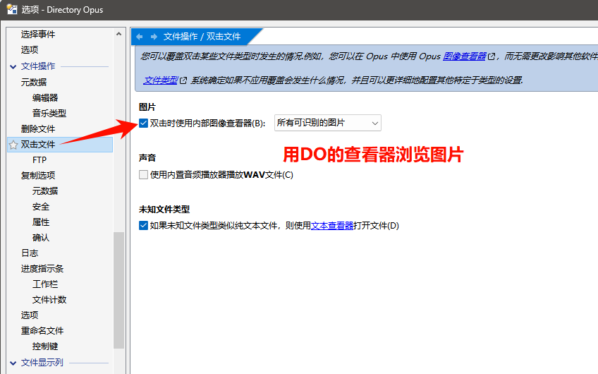
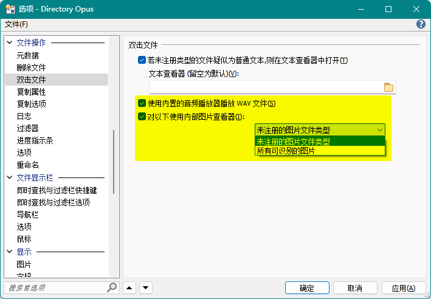
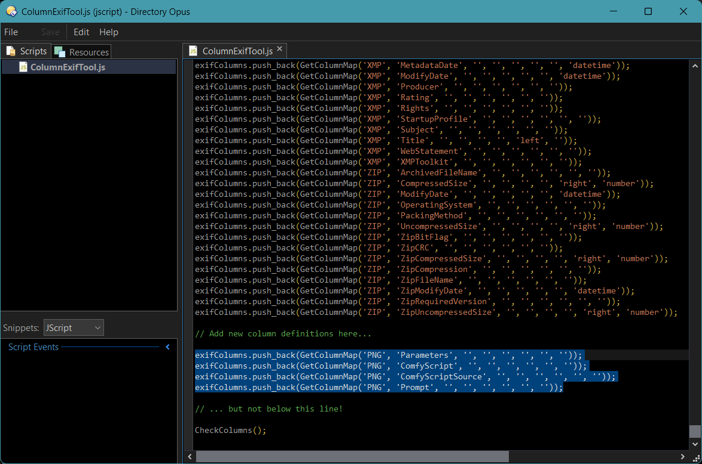
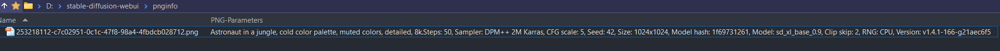
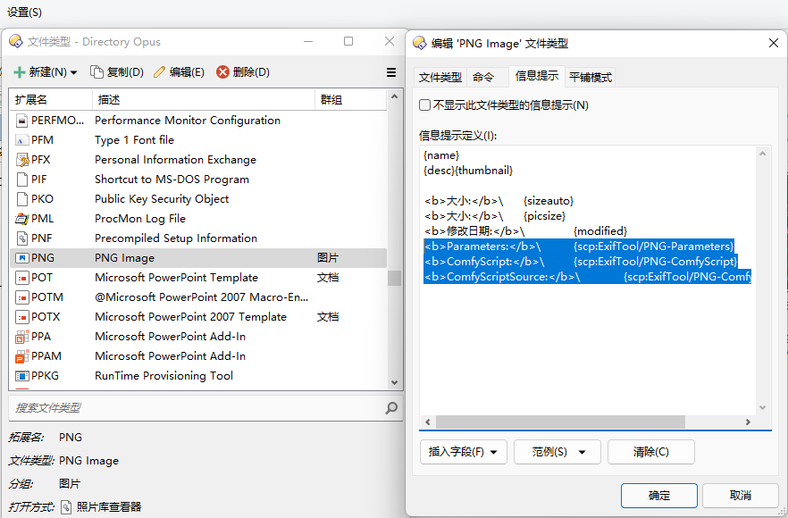
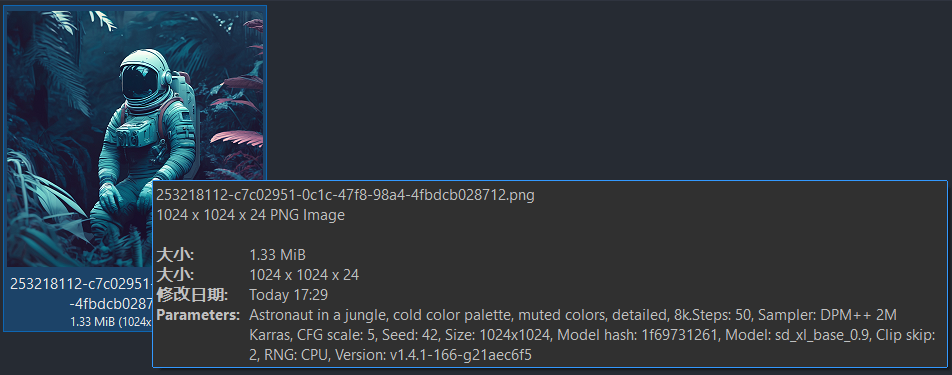

# 图片
## 使用内置查看器打开图片
默认配置下，DOpus 会使用内置查看器打开所有图片文件，可以通过以下选项控制：



关闭该选项后，DOpus 会使用系统默认关联程序来打开图片文件。

<details><summary>v12</summary>

默认配置下，DOpus 会使用内置查看器打开所有图片文件和 WAV 文件，这一行为可以通过以下选项控制：



</details>

## 预览
### [MultiView 插件](../浏览/查看/查看器.md#oracle-outside-in-viewer)
支持 BMP、PNG、JPEG、GIF、ICO、TIFF、SVG（仅 XML）、Adobe Photoshop PSD、Adobe Illustrator、Adobe InDesign、Microsoft Visio。

可能需要在配置中将 MultiView 插件的优先级调整到其它图片插件之前，或者在预览窗格中手动选择 MultiView 插件来使用。

## PNG 文本字段
DOpus 默认不支持查看 PNG 中的文本字段[^pnginfo][^pnginfo2]，可以通过安装 [ExifTool Custom Columns](https://resource.dopus.com/t/exiftool-custom-columns/38975?u=chaoses-ib) 来实现支持（需要 DOpus v13）：

1. 安装 [ExifTool](https://www.exiftool.org/)

   也可通过 [Scoop](https://scoop.sh/) 安装：`scoop install exiftool`

2. 安装 [`ColumnExifTool.js`](https://resource.dopus.com/t/exiftool-custom-columns/38975?u=chaoses-ib#:~:text=ColumnExifTool.js.txt)

3. 如果你的 ExitTool 没有安装在 `/programfiles\exiftool\exiftool.exe`，需要手动修改 `ColumnExifTool` 的 `exeExitTool` 配置（必须使用绝对路径，即使相应 EXE 在环境变量中）

   Scoop 的默认路径为：`%USERPROFILE%\scoop\shims\exiftool.exe`

4. 添加 [ExifTool.dop](https://resource.dopus.com/t/exiftool-custom-columns/38975?u=chaoses-ib#:~:text=Save-,ExifTool.dop,-to%E2%80%83%E2%80%83%E2%80%83%E2%86%93) 到工具栏，选择要查看的图片，在添加的工具栏中选择 `Tools → Probe Files`，它在当前文件夹会生成一个代码文件，例如：
   
   ```js
   exifColumns.push_back(GetColumnMap('PNG', 'ComfyScript', '', '', '', '', '', ''));
   exifColumns.push_back(GetColumnMap('PNG', 'ComfyScriptSource', '', '', '', '', '', ''));
   exifColumns.push_back(GetColumnMap('PNG', 'Prompt', '', '', '', '', '', ''));
   ```
   其中每行对应一个 PNG 文本字段。

5. 在 `ColumnExifTool` 的脚本代码尾部添加需要的文本字段的代码

   例如，可以添加以下代码来查看图片生成工具 [Stable Diffusion web UI](https://github.com/AUTOMATIC1111/stable-diffusion-webui)、[ComfyScript](https://github.com/Chaoses-Ib/ComfyScript) 和 [ComfyUI](https://github.com/comfyanonymous/ComfyUI) 的生成参数字段：

   ```js
   exifColumns.push_back(GetColumnMap('PNG', 'Parameters', '', '', '', '', '', ''));
   exifColumns.push_back(GetColumnMap('PNG', 'ComfyScript', '', '', '', '', '', ''));
   exifColumns.push_back(GetColumnMap('PNG', 'ComfyScriptSource', '', '', '', '', '', ''));
   exifColumns.push_back(GetColumnMap('PNG', 'Prompt', '', '', '', '', '', ''));
   ```

   

   也可打开 `/dopusdata/Script AddIns/ColumnExifTool.js` 进行编辑。

6. 此时即可通过添加列来查看相应字段：

   

7. 也可以在 PNG 类型的信息提示中添加相应字段，例如：
   
   ```html
   {name}
   {desc}{thumbnail}
    
   <b>大小:</b>\	{sizeauto}
   <b>大小:</b>\	{picsize}
   <b>修改日期:</b>\	{modified}
   <b>Parameters:</b>\	{scp:ExifTool/PNG-Parameters}
   <b>ComfyScript:</b>\	{scp:ExifTool/PNG-ComfyScript}
   ```
   
   

   

   <details><summary>English</summary>

   ```
   {name}
   {desc}{thumbnail}
    
   <b>Size:</b>\	{sizeauto}
   <b>Dimensions:</b>\	{picsize}
   <b>Modified:</b>\	{modified}
   <b>Parameters:</b>\	{scp:ExifTool/PNG-Parameters}
   <b>ComfyScript:</b>\	{scp:ExifTool/PNG-ComfyScript}
   ```
   </details>

需要注意的是，`ExifTool Custom Columns` 会在读取一张图片时自动读取并缓存当前文件夹的所有图片；多行字段会被折叠为一行；通过信息提示显示大量文本时可能出现卡顿。


[^pnginfo]: [Readout of PNG chunks - Help & Support - Directory Opus Resource Centre](https://resource.dopus.com/t/readout-of-png-chunks/44361?u=chaoses-ib)
[^pnginfo2]: [Showing tEXt chunks of PNGs? - Help & Support - Directory Opus Resource Centre](https://resource.dopus.com/t/showing-text-chunks-of-pngs/8159?u=chaoses-ib)