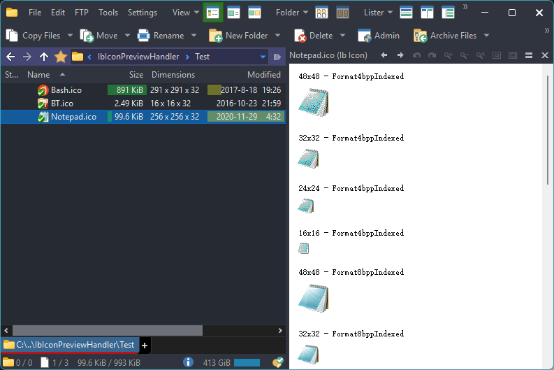

# ICO
## 预览
### DOpus 内置
DOpus 内置了对 ICO 的支持，但只能查看其中最大的图像。

由于内置支持不是通过插件实现的，无法将其它插件的优先级调整为高于内置，只能通过在预览窗格中手动指定来使用其它插件。

### [IbIconPreviewHandler](https://github.com/Chaoses-Ib/IbIconPreviewHandler)

