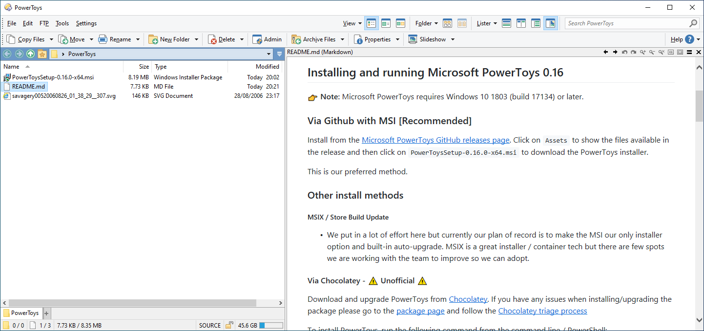

# Markdown
## 预览
### [PowerToys](https://github.com/microsoft/PowerToys)
1. [安装 PowerToys](https://aka.ms/getPowertoys)
2. 在 PowerToys 的 File Explorer add-ons 页中启用 Markdown 预览

效果图（也支持暗色模式）：[^do]

### [MarkdownPreview](https://github.com/Atrejoe/MarkdownPreview)
已停止维护。

[^do]: [Markdown (.md) viewers (Microsoft and others) - Viewer/VFS Plugins - Directory Opus Resource Centre](https://resource.dopus.com/t/markdown-md-viewers-microsoft-and-others/35051)