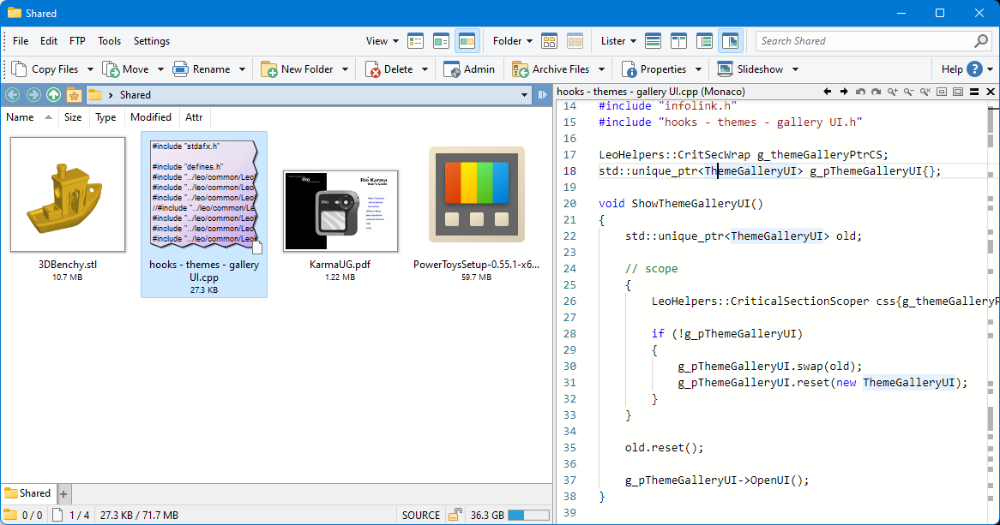

# 代码
## 预览
### [PowerToys](https://github.com/microsoft/PowerToys)
1. [安装 PowerToys](https://aka.ms/getPowertoys)
2. 在 PowerToys 的 File Explorer add-ons 页中启用 Source code files (Monaco) 预览
3. 由于 DOpus 在 v12.32 以上默认不会启用 PowerToys 的预览处理器[^12.32]，需要手动在配置窗口的 `查看器 → 插件` 页中打开元插件的配置窗口，勾选预览处理器中的 `PowerToys Source Code (Monaco)` 

效果图（也支持暗色模式）：[^powertoys-do]

默认支持以下格式：

> .abap .aes .ascx .asp .aspx .azcli .babelrc .bash .bicep .bowerrc .bsh .c .cake .cc .cjs .clj .cljc .cljs .cls .coffee .config .cpp .cpy .cs .cshtml .csproj .css .csx .ctp .cts .cxx .cyp .cypher .dart .dats .dax .dockerfile .dtd .ecl .editorconfig .edn .env .es6 .eslintrc .ex .exs .flow .fs .fsi .fsproj .fsscript .fsx .ftl .ftlh .ftlx .gemspec .gitattributes .gitconfig .gitignore .go .gql .graphql .gyp .gypi .h .handlebars .har .hats .hbs .hcl .hh .hpp .htm .html .html.liquid .hxx .i3 .iecplc .iecst .ig .inf .ini .ino .jade .jav .java .jl .js .jscsrc .jshintrc .jshtm .json .jsp .jsx .key .ksh .kt .kts .lc3lib .less .lex .ligo .liquid .log .lua .m .m3 .mdoc .mg .mjs .ml .mli .mligo .msdax .mts .opf .p .pas .pde .php .php4 .php5 .phtml .pl .pla .pm .pp .pq .pqm .properties .props .proto .ps1 .psd1 .psm1 .pug .py .pyw .qs .r .razor .rb .rbx .redis .reg .rhistory .rjs .rkt .rlib .rmd .rprofile .rpy .rq .rs .rst .rt .s .sats .sb .sbt .sc .scala .sch .scm .scss .sh .shtml .sln .sol .sql .ss .st .sv .svh .swift .targets .tcl .tf .tfvars .ts .tsx .twig .txt .v .vb .vbproj .vbs .vcxproj .vh .vsconfig .wgsl .wsdl .wxi .wxl .wxs .xaml .xhtml .xml .xsd .xsl .xslt .yaml .yml .zsh

由于 Monaco 预览使用了 WebView2 和 Monaco，加载速度较慢，推荐在元插件中从以上格式中移除 `.txt`。如果在预览 HTML 文件时希望显示网页而不是源代码，也需要从以上格式中移除 `.htm .html`。

另外，Monaco 预览的默认文件大小限制为 50 KB，可以在 PowerToys 设置中调整。

[^12.32]: [Directory Opus 12.32 - New Releases - Directory Opus Resource Centre](https://resource.dopus.com/t/directory-opus-12-32/44946?u=chaoses-ib)
[^powertoys-do]: [Source Code viewer from Microsoft - Viewer/VFS Plugins - Directory Opus Resource Centre](https://resource.dopus.com/t/source-code-viewer-from-microsoft/40467?u=chaoses-ib)