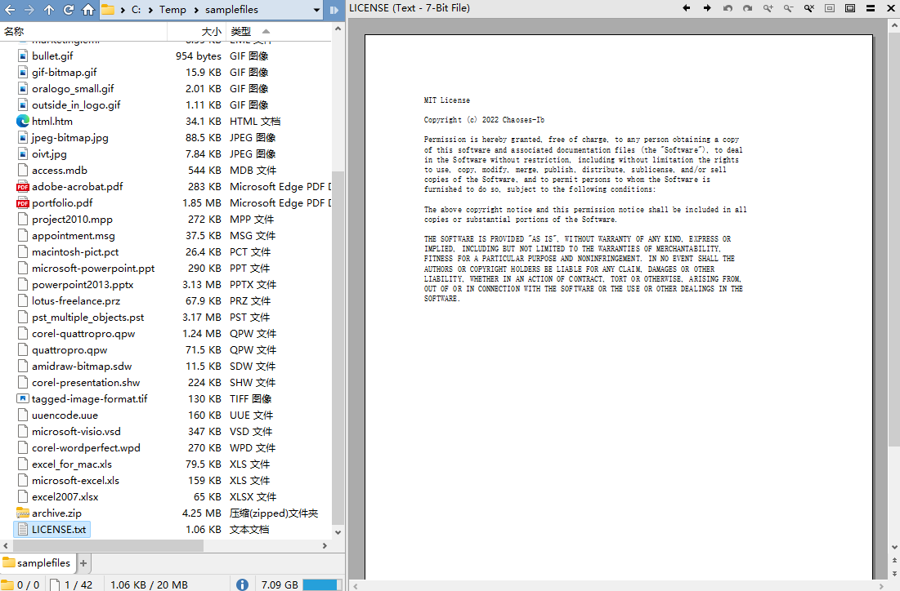

# 纯文本
## 预览
### Text 插件
DOpus 自带的 Text 查看器插件默认支持以下编码：
- ANSI（GBK）
- UTF-8 with BOM
- UTF-16 LE

如果在配置中勾选 `以 UTF-8 无 BOM 编码`，则支持以下编码：
- UTF-8
- UTF-8 with BOM
- UTF-16 LE

由于 Text 插件不同时支持 ANSI 和 UTF-8，我们只能根据自己的常用编码进行取舍，在遇到乱码时再手动在配置中切换。

### [MultiView 插件](../../浏览/查看/查看器.md#oracle-outside-in-viewer)
正常/草稿视图 | 预览视图
--- | ---
 | 

### [PowerToys](https://github.com/microsoft/PowerToys)
如果你安装了 PowerToys 并启用了 Monaco 预览，也在 DOpus 的元插件中启用了 Monaco 预览处理器，那么 DOpus 会使用 Monaco 来预览 `.txt`，它支持以下编码：
- UTF-8
- UTF-8 with BOM
- UTF-16 LE

由于 Monaco 预览加载较慢且无法预览 ANSI 编码文本，推荐在元插件中移除 Monaco 的 `.txt` 扩展名，使用默认 Text 插件进行预览。

v12.32 以下

如果你安装了 PowerToys 并启用了 Monaco 预览，那么 DOpus 默认会使用 Monaco 来预览 `.txt`，它支持以下编码：
- UTF-8
- UTF-8 with BOM
- UTF-16 LE

由于 Monaco 预览加载较慢且无法预览 ANSI 编码文本，推荐在 `ActiveX + Preview + Office + Web` 查看器插件中移除 Monaco 的 `.txt` 扩展名，使用默认 Text 插件进行预览。

