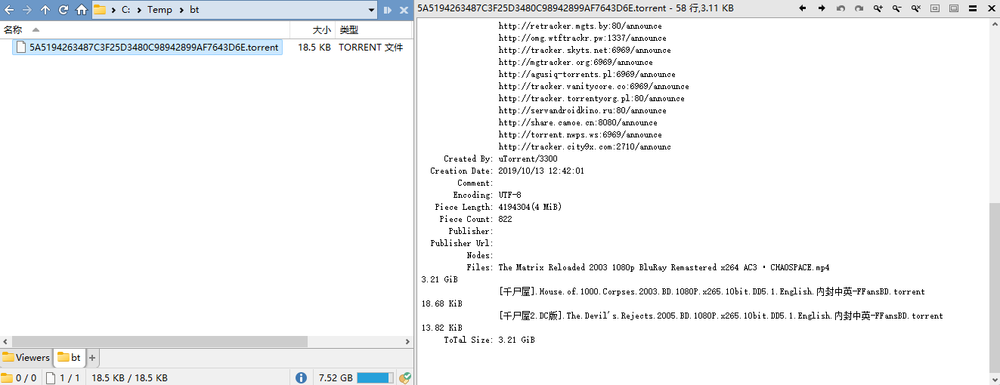

# 种子
BitTorrent 协议的种子文件（torrent file）是由 BitTorrent 协议所定义的，用于保存一组文件元数据的文件。扩展名一般为 `.torrent`。[^wiki]

## 预览
DOpus 没有内置的种子文件插件，可以使用 @laoqiuqiu 开发的插件来进行预览：

1. 下载 [Torrent](https://github.com/Chaoses-Ib/DirectoryOpus/releases#:~:text=Torrent) 插件
2. 解压到 `/home/Viewers` 目录（即 `C:\Program Files\GPSoftware\Directory Opus\Viewers`）

效果图：



完整格式如下，包含种子名、创建日期、文件列表、总大小：
```
           Name: The Matrix Reloaded 2003 1080p BluRay Remastered x264 AC3 • CHAOSPACE
      File Mode: Single-file
      SHA1 Hash: 5A5194263487C3F25D3480C98942899AF7643D6E
       Announce: http://tracker1.itzmx.com:8080/announce
  Announce List: http://tracker1.itzmx.com:8080/announce
                 http://retracker.telecom.by:80/announce
                 udp://tracker.opentrackr.org:1337/announce
                 ...
     Created By: uTorrent/3300
  Creation Date: 2019/10/13 12:42:01
        Comment: 
       Encoding: UTF-8
   Piece Length: 4194304(4 MiB)
    Piece Count: 822
      Publisher: 
  Publisher Url: 
          Nodes: 
          Files: The Matrix Reloaded 2003 1080p BluRay Remastered x264 AC3 • CHAOSPACE.mp4                                   3.21 GiB
                 [千尸屋].House.of.1000.Corpses.2003.BD.1080P.x265.10bit.DD5.1.English.内封中英-FFansBD.torrent             18.68 KiB
                 [千尸屋2.DC版].The.Devil's.Rejects.2005.BD.1080P.x265.10bit.DD5.1.English.内封中英-FFansBD.torrent         13.82 KiB
     ToTal Size: 3.21 GiB
```
文件列表和总大小不支持 BitTorrent v2。


[^wiki]: [种子文件 - 维基百科](https://zh.wikipedia.org/wiki/%E7%A7%8D%E5%AD%90%E6%96%87%E4%BB%B6)